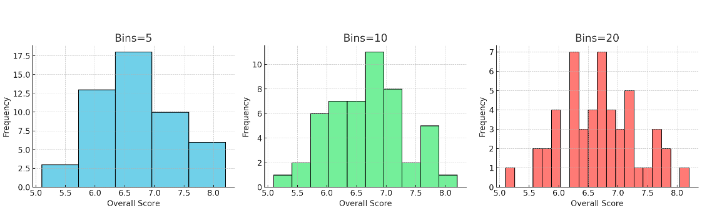

# Pandas 入门

[Pandas](https://pandas.pydata.org)是 Python 中最常用的数据分析库之一。

- 核心数据结构：
  
  - **Series**：一维数据（类似列表或一列数据）
  - **DataFrame**：二维表格数据（类似 Excel 表格）


- 常用于数据清洗、统计、处理、可视化。


## 可接受的数据

在处理表格型数据时（例如存储在电子表格或数据库中的数据），**pandas** 是最合适的工具。pandas 可以帮助你探索、清洗并处理数据。在 pandas 中，一张数据表被称为 **DataFrame**。


## 安装 Pandas

```python
pip install pandas
```


## 创建 Series

```python
import pandas as pd

# 创建一个 Series
s = pd.Series([10, 20, 30, 40], name="score")
print(s)
```


## 创建 DataFrame

```python
# 用字典创建 DataFrame
data = {
    "name": ["Alice", "Bob", "Charlie"],
    "age": [25, 30, 35],
    "score": [88, 92, 95]
}
df = pd.DataFrame(data)
print(df)
```


## CSV 数据基本操作

```python
# 读取数据

df = pd.read_csv('ielts_scores.csv')

# 说明：读取 CSV 文件，并展示前 5 行。
df.head()

# 查看前 5 行
print(df.head())

# 查看基本信息
# 说明：查看数据集的行数、列名、数据类型以及缺失值情况。
print(df.info())

# 描述性统计
# 展示每列的均值、标准差、最大值、最小值和分位数。
print(df.describe())

# 按性别统计平均总分
df.groupby('Gender')['Overall'].mean()

# 可视化：总分分布直方图
df['Overall'].plot(kind='hist', bins=10, title='Overall IELTS Score Distribution')
plt.xlabel('Score')
plt.show()


# 可视化：按性别的总分箱线图
df.boxplot(column='Overall', by='Gender')
plt.title('Overall IELTS Score by Gender')
plt.suptitle('')
plt.show()


```


## 直方图与条形图对比

 **直方图 (Histogram)** 和 **条形图 (Bar Chart)**容易混淆，但其实两者在用途和表现方式上有明显区别。


## 直方图  vs 条形图 

| 特点 | 直方图 (Histogram) | 条形图 (Bar Chart) |
|------|-------------------|-------------------|
| **数据类型** | 连续型数据（如分数、身高、收入） | 分类数据（如性别、城市、专业） |
| **X 轴含义** | 区间（bin），如 5.0–5.5 分 | 离散类别，如“男生”“女生” |
| **柱子是否相连** | 相连（表示连续区间） | 分开（表示独立类别） |
| **用途** | 展示数据分布，观察集中趋势与偏态 | 比较不同类别之间的数值高低 |
| **典型示例** | 学生成绩分布图 | 男生 vs 女生平均分对比 |


## bin 分桶

**bin = 分桶 = 区间**，将定了直方图的柱子数量和宽度，可以用来帮助我们更直观地理解 **连续数据的分布**


假设雅思总分在数据里是 **4.5 分到 9.0 分**，跨度大约是 4.5，bins=10 表示切成 **10 个小区间**，每个区间宽度大约是 0.45 分，分别是：

- 4.5 – 4.95
- 4.95 – 5.4
- 5.4 – 5.85
- ……
- 8.55 – 9.0


Bin= 5, 10和20的区别：



### 为什么要分桶


如果直接画所有点，数据会显得杂乱。分桶后，可以看到 数据的分布形态（是否集中、偏斜、呈正态）。Bin 越多 → 越精细，但可能显得杂乱。Bin 越少越粗略，但更直观。


## 箱线图

箱线图 (Boxplot)，展示了按性别划分的雅思总分 (Overall IELTS Scores) 分布情况。

- 箱体中间的横线 = 中位数。
  - 图中女生（F）的中位数大约在 **6.4 左右**，男生（M）的中位数大约在 **6.7 左右**
  - 男生的中位数略高一些。
- 箱体上下边分别是 第一四分位数 (Q1) 和 第三四分位数 (Q3)。
  - 表示中间 50% 的学生成绩分布范围。
  - 女生的箱体跨度较大 → 分数差异更大；男生的箱体更窄 → 分数分布更集中。
- 须表示大部分数据的范围
  - 女生的最低分接近 **5.3**，最高分接近 **8.1**；男生的范围在 **6.0–7.2** 左右
  - 女生成绩跨度比男生更大
- 须外的点是异常值
  - 男生有几个特别高的分数（7.6 和 8.4 左右），代表个别成绩特别好的学生
  - 女生没有特别突出的异常点


> **箱线图告诉我们：男生的雅思总分更集中，中位数略高，而女生的分布更分散。**


## 进阶练习

```python
# 找出总分最高的前 5 个学生

top5 = df.sort_values(by="Overall", ascending=False).head(5)
print(top5)

# 年龄 vs 总分 散点图
df.plot(kind="scatter", x="Age", y="Overall", title="Age vs Overall IELTS Score")
plt.show()


# 按性别统计各科平均分
avg_scores = df.groupby("Gender")[["Listening", "Reading", "Writing", "Speaking"]].mean()
print(avg_scores)

avg_scores.plot(kind="bar", title="Average IELTS Scores by Gender")
plt.ylabel("Score")
plt.show()


# 低于6.0的学生
low_scores = df[df["Overall"] < 6.0]
print(low_scores)

# 占比
ratio = len(low_scores) / len(df) * 100
print(f"Overall < 6.0 的学生比例: {ratio:.2f}%")
```


## 其他高阶操作

```python

# 1. 分组与聚合 (GroupBy & Aggregation)

# 按城市分组计算平均总分
df.groupby("City")["Overall"].mean()

# 按性别分组，同时计算多个指标
df.groupby("Gender").agg({
    "Overall": ["mean", "max", "min"],  # 总分的平均、最大、最小
    "Listening": "mean"                 # 听力的平均
})

# -------------------------------------------------------
# 2. 时间序列操作 (Time Series)

# 将字符串日期转为 datetime 格式
df["Date"] = pd.to_datetime(df["Date"])

# 按月份重采样，计算每月平均总分
df.set_index("Date").resample("M")["Overall"].mean()

# 计算滚动平均（窗口=3，表示连续3个数据的平均）
df["Rolling_Avg"] = df["Overall"].rolling(window=3).mean()

# -------------------------------------------------------
# 3. 数据合并与连接 (Merge & Concat)

# 模拟两个表 df1、df2，按 StudentID 合并（类似 SQL JOIN）
df1.merge(df2, on="StudentID", how="left")

# 纵向拼接（行拼接，类似 append）
pd.concat([df1, df2], axis=0)

# 横向拼接（列拼接）
pd.concat([df1, df2], axis=1)

# -------------------------------------------------------
# 4. 导入与导出 (I/O)

# 导入不同格式数据
pd.read_csv("data.csv")
pd.read_excel("data.xlsx")
pd.read_json("data.json")

# 导出数据到不同格式
df.to_csv("output.csv", index=False)
df.to_excel("output.xlsx", index=False)
df.to_json("output.json")
```

