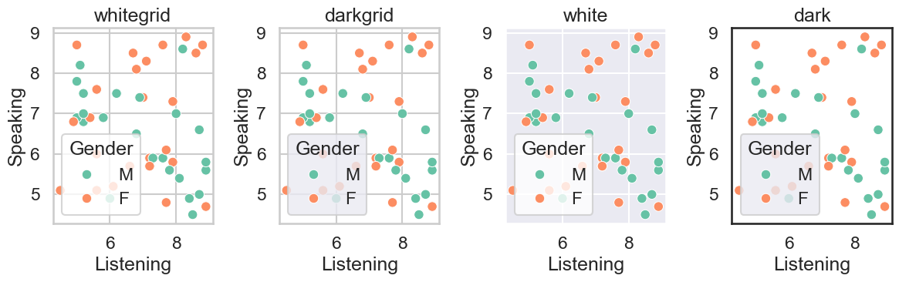
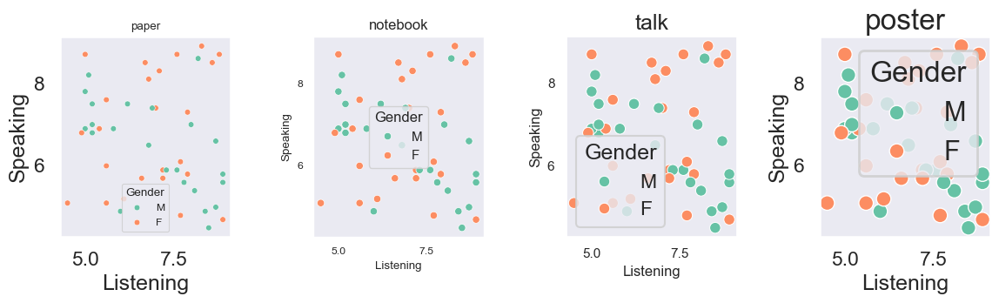
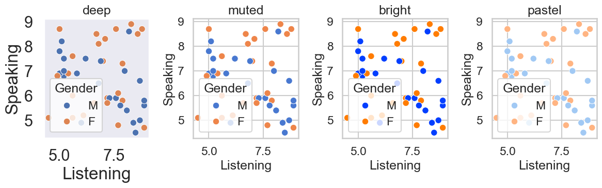

# Seaborn 入门

**[Seaborn](https://seaborn.pydata.org)** 是基于 Matplotlib 的高级可视化库。

特点：
- 默认风格美观，适合做统计图表。
- 和 **Pandas DataFrame** 无缝结合。
- 内置多种数据集（如 tips、iris、flights）。
- 内置统计功能（回归拟合、分布可视化）。


Seaborn 支持多种不同的数据集格式，大多数函数都能接受由 **pandas** 或 **numpy** 库的对象表示的数据，以及 Python 内置类型（如 **列表** 和 **字典**）。理解这些不同选项对应的使用模式，将帮助你快速为几乎任何数据集创建有用的可视化图表。


**安装方法**

```bash
pip install seaborn
```


## 与Pandas的绘图对比

主要是数据分析库，绘图功能是“附带的”，适合快速看数据，而且其绘图师基于 Matplotlib的，样式比较“原始”。

- **Pandas**：只能画基本的折线、直方图、条形图、散点图等。

- **Seaborn**：内置很多高级统计图，比如：

  - **箱线图 (boxplot)**、**小提琴图 (violinplot)** → 展示分布和差异
  - **热力图 (heatmap)** → 展示相关性矩阵
  - **回归拟合图 (lmplot)** → 自动加回归线
  - **Pairplot** → 多变量关系总览

  


## 快速入门

```python
# 在 Python 中导入

import seaborn as sns
import matplotlib.pyplot as plt


```

### 散点图对比

 **Pandas 散点图**

```python
df.plot(kind="scatter", x="Listening", y="Speaking")
```

**Seaborn 散点图（带分组和更美观样式）**

```python
sns.scatterplot(x="Listening", y="Speaking", hue="Gender", data=df)
plt.title("Listening vs Speaking Scores")
plt.show()
```


进行快速演示时，用 Pandas 自带的绘图功能已经足够，但在撰写分析报告或需要更高级的可视化时，Seaborn 会显得更加专业。


### 相关性检验

```python
# 皮尔逊相关系数（Pearson Correlation）

df[["Listening", "Speaking"]].corr()
```


> 如果相关系数 **> 0.6**，说明二者关系较强，可以考虑作为学习上的配套指标。


## 美化

### 改变marker

把默认的圆点（"o") 换成 “x”，只需要设置 marker="x"，还可以用 marker="^"（三角形）、marker="s"（方块）等。

```python
# 把默认的圆点（"o") 换成 “x”，只需要设置 marker="x"

sns.scatterplot(x="Listening", y="Speaking", hue="Gender", marker="x", data=df)
plt.title("Listening vs Speaking Scores")
plt.show()
```


### Listening vs Speaking 散点图美化

```python
import seaborn as sns
import matplotlib.pyplot as plt

sns.set_style("whitegrid")  # 设置背景
sns.scatterplot(
    x="Listening",
    y="Speaking",
    hue="Gender",
    data=df,
    marker="x",   # 改 marker
    s=100,        # 点大小
    alpha=0.6,    # 透明度
    palette="Set2" # 配色方案
)
plt.title("Listening vs Speaking Scores")
plt.xlabel("Listening Score")
plt.ylabel("Speaking Score")
plt.show()
```


### 主题与风格

```
sns.set_style("darkgrid")   # 背景带网格
sns.set_context("talk")     # 适合讲座展示
sns.set_palette("Set2")     # 配色方案
```


### Seaborn 全局设置速查表

| 功能 | 方法 | 可选参数值 | 示例 | 用途说明 |
|------|------|------------|------|----------|
| **背景风格 (style)** | `sns.set_style()` | `"white"`（纯白背景）、`"dark"`（深色背景）、`"whitegrid"`（白底带网格）、`"darkgrid"`（暗色带网格）、`"ticks"`（带刻度线） | `sns.set_style("darkgrid")` | 控制背景和网格样式，常用 `"whitegrid"` 或 `"darkgrid"`，适合数据展示 |
| **展示场景 (context)** | `sns.set_context()` | `"paper"`（最小，适合论文）、`"notebook"`（默认，适合日常分析）、`"talk"`（放大字号，适合讲座）、`"poster"`（最大，适合大屏展示） | `sns.set_context("talk")` | 调整字体、线条、点的整体缩放比例，根据场景切换展示效果 |
| **配色方案 (palette)** | `sns.set_palette()` | `"deep"`（默认）、`"muted"`、`"bright"`、`"pastel"`、`"dark"`、`"colorblind"`，以及分类配色（如 `"Set1"`, `"Set2"`, `"Set3"`），或渐变配色（如 `"coolwarm"`, `"Blues"`, `"viridis"`） | `sns.set_palette("Set2")` | 控制颜色风格，分组绘图时效果明显，能提升可读性和美观度 |


#### 不同风格



#### 不同场景


#### 不同配色



### **绘图美化速查表**


| **功能**                    | **参数/方法**                | **示例**                           | **效果说明**                                                 |
| --------------------------- | ---------------------------- | ---------------------------------- | ------------------------------------------------------------ |
| **点的形状 (marker)**       | marker                       | marker="x"                         | 点形状："o" 圆点 (默认)，"x" 叉号，"s" 方块，"^" 三角形      |
| **点的大小 (size)**         | s                            | s=100                              | 控制点的大小                                                 |
| **透明度 (alpha)**          | alpha                        | alpha=0.6                          | 让点更透明，避免重叠过密                                     |
| **颜色 (color)**            | color                        | color="red"                        | 所有点统一颜色                                               |
| **调色板 (palette)**        | palette                      | palette="Set2"                     | 分组配色，可选 "deep", "Set1", "coolwarm" 等                 |
| **背景风格 (style)**        | sns.set_style()              | sns.set_style("whitegrid")         | 可选 "white", "dark", "whitegrid", "darkgrid"                |
| **展示场景 (context)**      | sns.set_context()            | sns.set_context("talk")            | 缩放字体/线宽/点大小；可选 "paper" < "notebook"(默认) < "talk" < "poster" |
| **趋势线**                  | sns.lmplot() / sns.regplot() | sns.lmplot(x="X", y="Y", data=df)  | 自动加回归线，便于看趋势                                     |
| **标题 (title)**            | plt.title()                  | plt.title("Listening vs Speaking") | 添加图表标题                                                 |
| **轴标签 (xlabel, ylabel)** | plt.xlabel(), plt.ylabel()   | plt.xlabel("Listening")            | 设置横纵坐标说明                                             |


## 使用 Seaborn 自带数据集进行探索

Seaborn 附带了一些常见的数据集，可以帮助我们快速学习可视化方法，而不必自己准备数据。


### 查看 Seaborn 自带数据集
```python
import seaborn as sns

# 列出所有内置数据集名称
print(sns.get_dataset_names())
```


### 加载数据集

```python
# 加载“小费”数据集
tips = sns.load_dataset("tips")
tips.head()
```


### 基本探索

```python
# 查看数据基本信息
tips.info()

# 描述性统计
tips.describe()

# 散点图：账单与小费关系
sns.scatterplot(x="total_bill", y="tip", data=tips)

# 箱线图：不同性别的小费差异
sns.boxplot(x="sex", y="tip", data=tips)

# 小提琴图：不同日期的小费分布
sns.violinplot(x="day", y="tip", data=tips)

# 热力图：变量之间的相关性
corr = tips.corr(numeric_only=True)   # 计算相关性矩阵
sns.heatmap(corr, annot=True, cmap="coolwarm")
plt.show()
```

