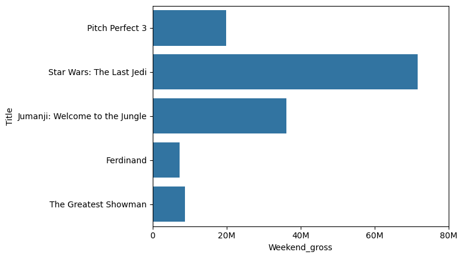
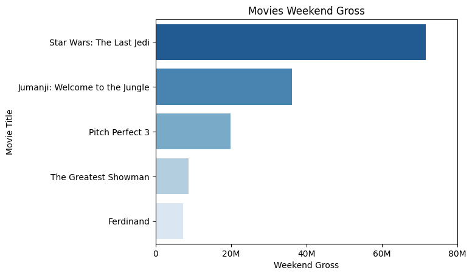
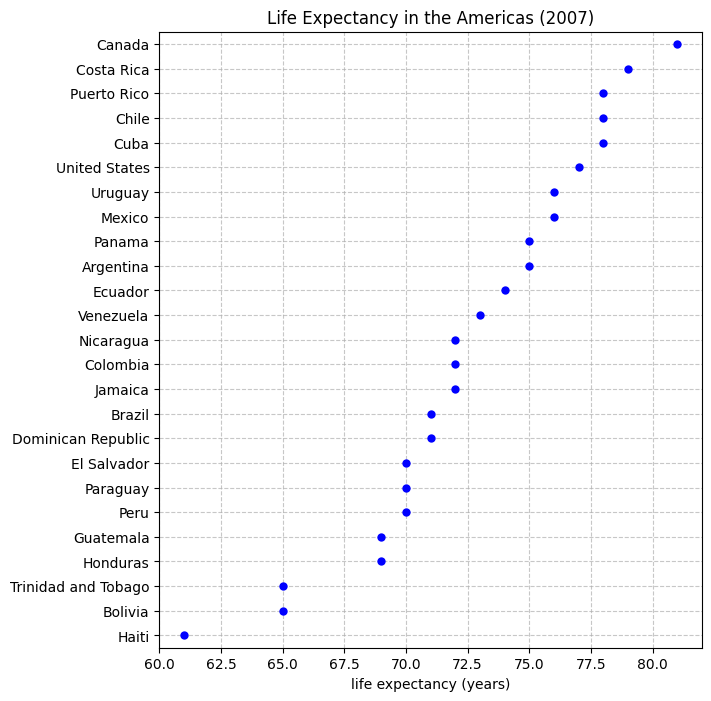

# 条形图绘制

## 素材


## 数据处理

导入必要库

```python
import pandas as pd
import seaborn  as sns
import matplotlib.pyplot as plt
```


```python
df2=pd.read_csv("movies_weekend_gross.csv")
df2.head()
```


## 绘图

### 直接出图

```python
sns.barplot(data=df2, x="Weekend_gross", y="Title")
```




这个图不便于读者了解票房的排名和差异。


### 对数据进行排序

```python
# 排序依据 Weekend_gross，降序
df2_sorted = df2.sort_values(by="Weekend_gross", ascending=False)

# 保存排序后的数据，
df2_sorted.to_csv("movies_weekend_gross_sorted.csv", index=False)

# 重新基于排序后的数据绘图
sns.barplot(data=ddf2_sorted, x="Weekend_gross", y="Title")


```

> pandas 在保存 CSV 时，**默认会把 DataFrame 的行索引（index）也写进 CSV 文件**，作为最左边的一列。加上 index=False 就告诉 pandas：不要把 index 写到 CSV 里。


### 添加刻度

`xlim()`用来设置横坐标（x 轴）的最小值和最大值，0 表示 x 轴的起始值，80000000 表示 x 轴的结束值。

`xticks（）`可以指定 **x 轴刻度的位置**，并指定**对应刻度的显示文字**。20M表示 20 million（两千万），是一种简写格式，更方便读者阅读。

```python
# 增加刻度
plt.xlim(0, 80000000)
plt.xticks([0, 20000000, 40000000, 60000000, 80000000],
           ["0", "20M", "40M", "60M", "80M"])


# 添加X轴，Y轴和标题

plt.xlabel("Weekend Gross")
plt.ylabel("Movie Title")
plt.title("Movies Weekend Gross")
```


### 使用颜色进一步区分

在 seaborn 的绘图函数里，hue 是一个非常重要的参数，可用来指定"分类变量"，即让同一个 x 或 y 位置的条形（或点、线）按照类别再分组，显示成不同颜色。简单说：hue="某一列" ，seaborn 会根据这一列的不同取值，自动分配不同的颜色。

调色板有不同类型：
- 顺序调色板 (Sequential palettes)：颜色从浅到深连续变化，用来表现有大小顺序的数据，比如数值大小、概率高低。例子："Blues", "rocket", "mako"。
- 定性调色板 (Qualitative palettes)：每种颜色差别明显，没有深浅顺序，用来区分类别，比如不同的电影、城市。例子："deep", "bright", "Set2"。


**顺序调色板**

这里的 "Blues" 是一个 **顺序调色板**（Sequential colormap），默认颜色是从浅蓝到深蓝。大多数 seaborn / matplotlib 的调色板都支持加 "_r" 来反转，`Blues_r`，表示从深蓝到浅蓝。
```
sns.barplot(data=df2_sorted, x="Weekend_gross", y="Title",hue="Title",dodge=False, palette="Blues_r")
```





**定性调色板**

`palette`可选择预制调色板

你可以把 "pastel" 换成其他名字，比如：

- "deep"
- "bright"
- "muted"
- "colorblind"
- "Set2"
- "Paired"
- "rocket" 
- "RdBu"

```
# 替换上一步的代码，其他不变

sns.barplot(data=df2_sorted, x="Weekend_gross", y="Title",hue="Title",dodge=False, palette="pastel")


```


Pastel 配色的效果


## 点图绘制

用点的位置表示数值，不强调面积或长度，不一定要从零开始，可以聚焦在一个区间，突出细微差别。

适用场景：
- 数值范围相对集中时：比如预期寿命（60–81 岁），如果用 bar 图，柱子差别不大；点图更能突出小的差异。
- 要减少视觉负担时：点比条形更简洁，不会因为条太长而分散注意力。
- 需要比较多个组的分布：点图能清晰显示每组的具体位置，适合多个条件对比。


```python
import pandas as pd
import seaborn as sns
import matplotlib.pyplot as plt


df3=pd.read_csv('life_expectancy_americas_2007.csv')

# 绘制点图
plt.figure(figsize=(7, 8))
sns.stripplot(
    data=df,
    x="LifeExp",
    y="Country",
    color="blue",
    size=6,
    jitter=False,
    orient="h"
)

plt.xlabel("life expectancy (years)")
plt.ylabel("")
plt.title("Life Expectancy in the Americas (2007)")
plt.xlim(60, 82)

# 开启网格
plt.grid(True, axis="both", linestyle="--", alpha=0.7)
plt.show()
```

