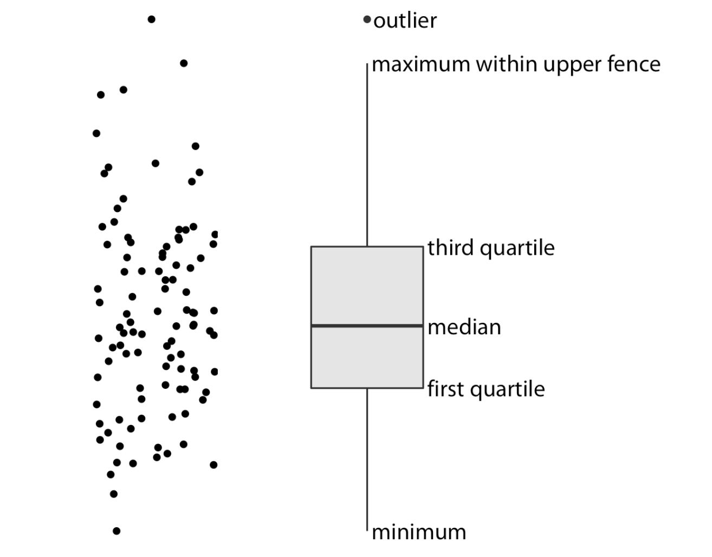
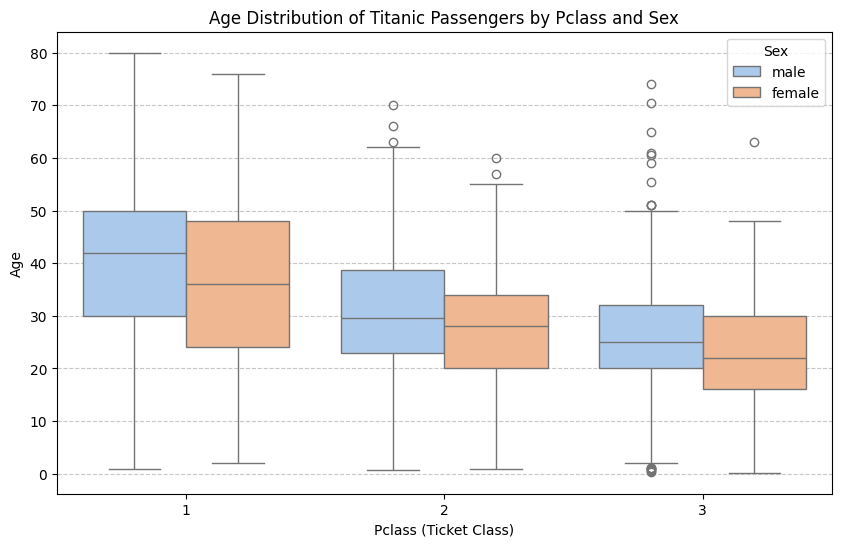

# 箱线图

## 简介

箱线图能直观地显示数据的**中位数、上下四分位数（Q1、Q3）、最小值、最大值**，让人快速了解数据的分布范围和集中趋势。箱线图通过“须”（whiskers）之外的点来标记**异常值**（outliers）。这在探索性数据分析（EDA）时非常有用，可以帮助我们发现异常情况或数据输入错误。





###  比较多个组之间的差异


当我们画多个类别的箱线图时，可以直观比较不同类别的：
- 中位数差异（谁的典型值更大）
- 分布范围（哪组更分散或更集中）
- 异常值分布情况


箱线图常与**散点图（strip plot, swarm plot）**或**小提琴图（violin plot）**结合：

- 箱线图 → 总体统计特征。
- 点图/小提琴图 → 数据点分布的细节。


## 绘制


### 数据准备


```python
import seaborn as sns
import matplotlib.pyplot as plt
import pandas as pd

# 读取 Titanic 数据
titanic = pd.read_csv("Titanic.csv")

# 删除缺失的年龄数据
titanic_age = titanic.dropna(subset=["Age"])

```


### 绘制箱线图


```python
# 绘制箱线图：性别 vs 年龄
plt.figure(figsize=(10,6))
sns.boxplot(data=titanic_age, x="Pclass", y="Age", hue="Sex", hue_order=["male", "female"], palette="pastel")

plt.title("Age Distribution of Titanic Passengers by Pclass and Sex")
plt.xlabel("Pclass (Ticket Class)")
plt.ylabel("Age")
plt.grid(axis="y", linestyle="--", alpha=0.7)
plt.show()
```


