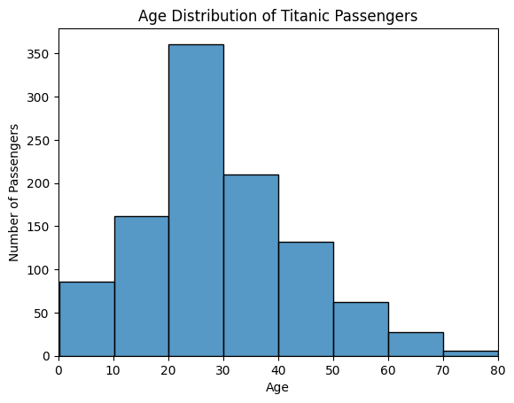

# 直方图与核密度图


## 直方图简介

直方图是一种常见的统计图表，用来展示数据的分布情况。


直方图是把连续型数据（如年龄、身高、收入）按照一定的区间（bin，组距）进行分组统计，然后用相邻的矩形柱子表示各区间的数据频数（人数）或频率（比例）的图表。

- **横轴 (x-axis)**：数值区间（如年龄 0–10 岁、10–20 岁……）。
- **纵轴 (y-axis)**：落在该区间内的数据数量（频数）或比例（频率）。
- **矩形面积**：与该区间的数据量成正比。

作用
1. **展示数据分布**  
   可以直观地看到数据是集中在某些区间，还是比较分散。  
   例如：泰坦尼克号的直方图能看出 20 岁左右的乘客最多。  

2. **发现数据特征**  
   - 是否呈正态分布（钟形曲线）。  
   - 是否偏态（偏向一边）。  
   - 是否有多峰（多个高点）。  

3. **发现异常值**  
   如果有个柱子远离其他数据，说明该区间人数异常少或异常多，可能有特殊情况或异常值。  

4. **便于比较**  
   不同群体（如男性 vs 女性）的直方图可以放在一起比较，观察差异。  


## 绘制直方图

数据来源：[Titanic - Machine Learning from Disaster](https://www.kaggle.com/c/titanic/data)


### 输出读取


```python
# 引入所需库
import pandas as pd
import seaborn  as sns
import matplotlib.pyplot as plt

# 读取和查看数据
df=pd.read_csv("Titanic.csv")
df.head()
df.info()

# 去除没有Age数据的行
df=df.dropna(subset=['Age'])

# 查看数据形状
df.shape


```


df.shape，的输出是 (1046, 12)，其含义是：

- 1046：数据框（DataFrame）里有 1046 行，即 1046 条乘客记录。
- 12：数据框里有 12 列，即包含 12 个不同的字段（比如 Name, Age, Sex, Fare 等）。


### 绘制直方图

```python
sns.histplot(data=df, x="Age", bins=10)

plt.title("Age Distribution of Titanic Passengers")
plt.xlabel("Age")
plt.ylabel("Number of Passengers")
plt.xlim(0, 90)
```





### 增加KDE


```python
# 将kde参数设置为True

sns.histplot(data=df, x="Age", bins=10, kde=True)

plt.title("Age Distribution of Titanic Passengers")
plt.xlabel("Age")
plt.ylabel("Number of Passengers")
plt.xlim(0, 80)
```


## 核密度估计（Kernel Density Estimation, KDE）

### 定义
核密度估计是一种**非参数方法**，用于估计随机变量的概率密度函数。它通过在每个样本点位置放置一个小的平滑函数（通常是高斯函数），再把这些函数叠加平均，得到一条连续的分布曲线。其数学公式为：


- \(nn\)：样本数量  
- \(h\)：带宽（bandwidth），控制曲线的平滑程度  
- \(K(\cdot)\)：核函数（kernel），常用高斯核  


### 功能
- 显示数据的整体分布趋势  
- 判断分布形态（单峰、多峰、偏态等）  
- 提供连续化的分布估计，便于概率计算  


不同带宽的效果图如下：


### KDE 与直方图的异同

相同点
- 都用于描述数据的分布情况  
- 都能显示数据在哪些区间更集中  

不同点
- **直方图**：  
  - 将数据分成若干区间（bin），统计每个区间的频数/频率  
  - 图形呈阶梯状，结果依赖于 bin 的大小和起点选择  
- **KDE**：  
  - 用平滑核函数叠加形成连续曲线  
  - 不依赖于 bin 的划分，受带宽参数影响  -

### KDE 的优势
1. **平滑直观**：相比直方图的“方块感”，KDE 更易看出分布趋势  
2. **不依赖分箱**：避免了直方图中因 bin 宽度选择不同而导致的形态差异  
3. **可揭示潜在结构**：能更清晰地发现数据中的多峰现象或细微差别  
4. **便于比较**：在同一坐标轴上叠加多条 KDE 曲线，比直方图更容易比较不同群体的分布  


直方图是“离散的统计”，KDE 是“连续的估计”。KDE 能更平滑、直观地展示数据分布，是直方图的重要补充。


## 绘制kde

```python
sns.kdeplot(data=df, x="Age", fill=True)
plt.title("Age Density of Titanic Passengers")
plt.xlabel("Age")
plt.ylabel("Density")
plt.xlim(0, 80)
plt.show()
```


> 和直方图比，核密度图能更平滑地展示分布趋势，不会因为柱子宽度不同而让图形忽上忽下，更容易看出总体趋势。


## 同时可视化多个分布


### 直方图同时显示男女


假设我们想看看泰坦尼克号乘客的年龄在男性与女性之间是如何分布的。男性和女性乘客的年龄总体上是否相似，还是在性别之间存在年龄差异？

```python
sns.histplot(data=df, x="Age", bins=10, hue="Sex", kde=False, multiple="stack", palette="pastel", alpha=0.7)

plt.title("Age Distribution of Titanic Passengers")
plt.xlabel("Age")
plt.ylabel("Number of Passengers")
plt.xlim(0, 80)
```


Multiple 可选参数为：

- layer，默认，不同类别的直方图重叠显示，会重叠
- stack，堆叠直方图
- fill （100% 堆叠图。每个柱子高度标准化为 1）
- dodge (男女并排)


调整男女数据堆叠是顺序：


```py
 hue_order=["male", "female"]  # 指定顺序
  
```


## 重叠式堆叠

```python
sns.histplot(data=df, x="Age", bins=10, hue="Sex", kde=False, multiple="layer", palette="pastel", alpha=0.7)

plt.title("Age Distribution of Titanic Passengers")
plt.xlabel("Age")
plt.ylabel("Number of Passengers")
plt.xlim(0, 80)


```

男女的数据是一起堆叠的，而且男性的蓝色和女性的橙色，融合后成为了灰色。


## 重叠式KDE

```python
# KDE 按性别分组填充
ax = sns.kdeplot(
    data=df,
    x="Age",
    hue="Sex",                 # 分类：male / female
    fill=True,                 # 填充曲线下面积
    common_norm=False,         # 各组各自归一化，更利于对比
    alpha=0.8,                 # 透明度
    bw_adjust=0.9,             # 带宽调节，<1 更尖锐，>1 更平滑
    clip=(0, None),            # 不允许出现负年龄
    linewidth=2,
    palette="pastel"         # 颜色主题
)

# 标注与范围
ax.set_xlabel("age (years)")
ax.set_ylabel("scaled density")      # 与示例一致的坐标轴文字
ax.set_title("Age density of Titanic passengers")
ax.set_xlim(0, 80)
plt.legend(title="gender", labels=["male", "female"])         # 图例标题

plt.show()
```

