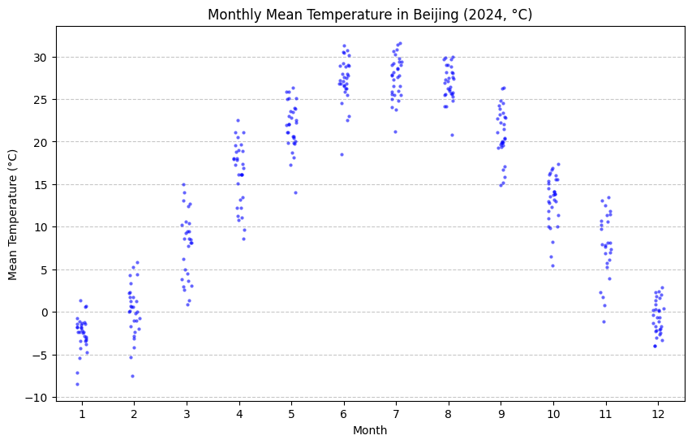

# 条带图

条带图将每个观测值画成一个点，沿着某个坐标轴排列，可以直观地看到数值的离散程度、集中趋势以及是否有异常值。

直方图 / 箱线图只能展示整体形态或分位数，条带图则把每个数据点都显示出来，信息更完整。如果点数不多，条带图能清晰展现每个观测，数据点很多时，可能会出现重叠，此时通常搭配 抖动（jitter） 或 swarmplot 来避免点重叠。


## 绘制

```python
import pandas as pd
import seaborn as sns
import matplotlib.pyplot as plt

df = pd.read_csv("Beijing.csv")
# 日期转换
df["DATE"] = pd.to_datetime(df["DATE"])
df["MONTH"] = df["DATE"].dt.month

# 温度从华氏转为摄氏
df["TEMP_C"] = (df["TEMP"] - 32) * 5/9

plt.figure(figsize=(10,6))
sns.stripplot(
    data=df,
    x="MONTH",
    y="TEMP_C",
    jitter=True,      # 抖动，避免重叠
    alpha=0.6,
    color="blue",
    size=3
)

plt.title("Monthly Mean Temperature in Beijing (2024, °C)")
plt.xlabel("Month")
plt.ylabel("Mean Temperature (°C)")
plt.grid(axis="y", linestyle="--", alpha=0.7)
plt.show()
```

