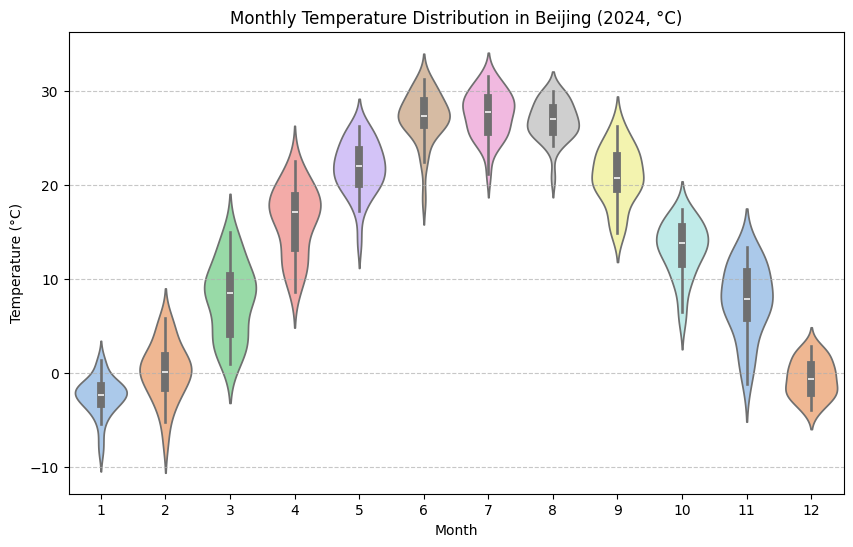

# 小提琴图


小提琴图（violin plot）结合了箱线图（box plot）和核密度估计（KDE）的优点，用来展示数据分布。

**外形**

小提琴的“外形”是通过核密度估计画出的，越宽代表该数值区间的数据越密集，越窄代表数据稀疏。对称的“左右两半”是为了美观，本质上是一条密度曲线的镜像。

**内嵌箱线图**

小提琴图中通常嵌有一个小的箱线图，中间的白点或横线表示中位数，粗的矩形区域表示四分位距，细线延伸的部分表示数据的大致范围。

小提琴图回答的是两个问题——数据大致分布在哪些区间？以及分布的形态是均匀的、偏斜的，还是多峰的。相比单纯的箱线图，它能更直观地展示“数据密度的形状”。


## 绘制

```python
import pandas as pd
import seaborn as sns
import matplotlib.pyplot as plt

# 日期处理
df["DATE"] = pd.to_datetime(df["DATE"])
df["MONTH"] = df["DATE"].dt.month

# 温度从华氏转摄氏
df["TEMP_C"] = (df["TEMP"] - 32) * 5/9

# 绘制小提琴图
plt.figure(figsize=(10,6))
sns.violinplot(
    data=df,
    x="MONTH", 
    y="TEMP_C", 
    inner="box",       # 在小提琴内部加上箱线图
    palette="pastel"     # 颜色主题
)

plt.title("Monthly Temperature Distribution in Beijing (2024, °C)")
plt.xlabel("Month")
plt.ylabel("Temperature (°C)")
plt.grid(axis="y", linestyle="--", alpha=0.7)
plt.show()
```



