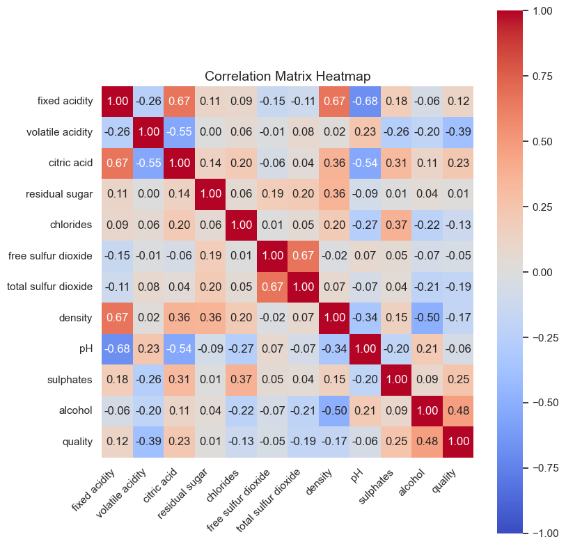
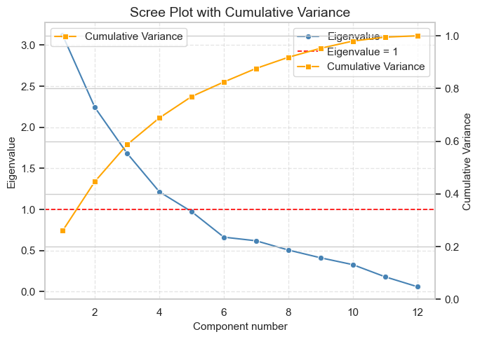
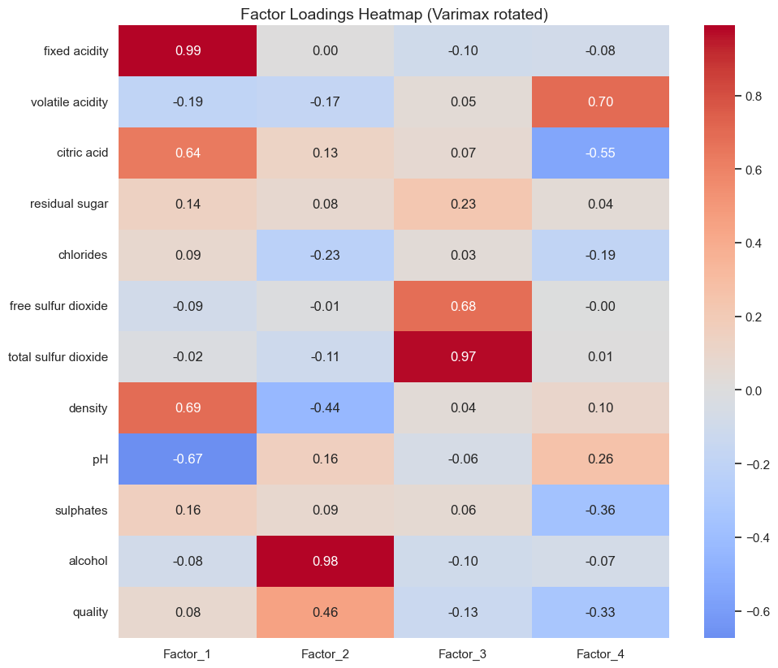
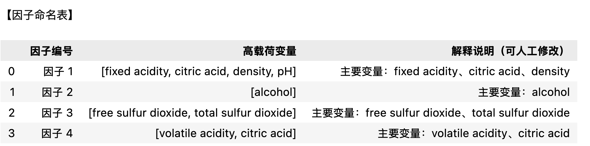

# 因子分析

因子分析是一种**多变量统计方法**，用于研究多个观测变量之间的相关结构，从中提取出少数几个能够解释这些变量共同变化的**潜在因子（latent factors）**。

它的基本思想是：


> 一组高度相关的变量往往受到某些共同潜在因素的影响，因子分析通过数学方法将这些潜在因素提取出来，以揭示数据的内在结构。


因子分析不是为了预测，而是为了“发现结构”。它告诉我们，哪些变量是一类（由同一个潜在因子驱动），以及这些潜在因子各自代表什么。


## 因子分析步骤


### **1. 数据准备与标准化**

- **目的**：消除量纲影响，使不同指标可比。

- **操作**：使用 StandardScaler 或 Z-score 标准化。

- **输出图表**：

  

  - **相关矩阵热图（Correlation Heatmap）**

    用于直观观察变量间相关性是否较强（适合做因子分析）。

  

### **2. 适用性检验**

- **目的**：判断数据是否适合做因子分析。
- **操作**：
  - **KMO 检验**（Kaiser-Meyer-Olkin）
  - **Bartlett 球形检验**
- **结果解释**：
  - KMO > 0.6 表示适合；
  - Bartlett 检验显著（p < 0.05）表示相关性足够。
- **输出表格**：
  - KMO 值和 Bartlett 检验结果表。


### **3. 提取因子（Factor Extraction）**

- **目的**：确定潜在因子数量。
- **方法**：主成分法（Principal Component）或最大似然法（ML）。
- **输出图表**：
  - **碎石图（Scree Plot）**：展示特征值（Eigenvalues）的下降趋势，确定拐点位置。
  - **累计方差贡献率图（Cumulative Variance Plot）**


### **4. 因子旋转（Factor Rotation）**

- **目的**：让因子结构更清晰（每个变量主要载荷在一个因子上）。

- **方法**：常用 Varimax（正交旋转）或 Oblimin（斜交旋转）。

- **输出表格**：

  - **因子载荷矩阵（Factor Loadings Table）**
  - 若有旋转前后对比，也可输出两张表比较。

- **输出图表**：

  - **因子载荷热图（Factor Loadings Heatmap）**

    用颜色显示变量在不同因子上的载荷强度。

  

### **5. 因子得分计算（Factor Scores）**


- **目的**：计算每个样本在各因子上的得分。

- **输出图表**：

  - **因子得分散点图（Factor Score Scatter Plot）**

    可用前两个因子作坐标轴，展示样本聚类特征。

  

### **6. 因子解释与命名**


- **目的**：根据高载荷变量解释每个因子的含义。
- **输出表格**：
  - 因子命名表（列出每个因子对应的高载荷变量及解释）。


## 可视化图表总结表

| **步骤** | **图表类型**     | **图表内容**         | **工具（Python）**                                           |
| -------- | ---------------- | -------------------- | ------------------------------------------------------------ |
| 1        | 相关矩阵热图     | 各变量之间的相关性   | sns.heatmap(corr)                                            |
| 2        | KMO & Bartlett表 | 检验统计结果         | factor_analyzer.calculate_kmo, calculate_bartlett_sphericity |
| 3        | 碎石图           | 特征值趋势确定因子数 | plt.plot(eigenvalues)                                        |
| 3        | 累计方差贡献图   | 解释方差占比         | plt.bar()                                                    |
| 4        | 因子载荷热图     | 各变量在因子上的权重 | sns.heatmap(loadings)                                        |
| 5        | 因子得分散点图   | 样本分布             | plt.scatter(scores[:,0], scores[:,1])                        |
| 6        | 因子解释表       | 各因子的含义说明     | pd.DataFrame                                                 |


## 代码

```python
# =========================================================
# 因子分析（以 winequality-red.csv 为例，Seaborn 绘图版）
# 特点：
# - 中文注释 + 英文图表
# - 包含 Correlation Heatmap
# - Scree Plot 含累计方差曲线与红线（Eigenvalue=1）
# - 因子提取与 Varimax 旋转
# =========================================================

import os
import numpy as np
import pandas as pd
import seaborn as sns
import matplotlib.pyplot as plt
from sklearn.preprocessing import StandardScaler
from sklearn.decomposition import FactorAnalysis

# -----------------------------
# 0) 数据读取与预处理
# -----------------------------
sns.set_theme(style="whitegrid")

CSV_PATH = "winequality-red.csv"  # 请修改为你的路径
if not os.path.exists(CSV_PATH):
    raise FileNotFoundError("请将 winequality-red.csv 放在脚本同目录下。")

# 读取 UCI 红酒数据（分号分隔），仅保留数值列
df = pd.read_csv(CSV_PATH, sep=";").select_dtypes(include=[np.number]).dropna()
cols = df.columns.tolist()
p = len(cols)

# 标准化数据
scaler = StandardScaler()
X_std = scaler.fit_transform(df)
R = np.corrcoef(X_std, rowvar=False)
n = X_std.shape[0]

# -----------------------------
# 1) 相关性热图 (Correlation Matrix Heatmap)
# -----------------------------
# 说明：因子分析前通常需查看变量之间的相关程度
plt.figure(figsize=(0.45 * p + 3, 0.45 * p + 3))
ax = sns.heatmap(pd.DataFrame(R, index=cols, columns=cols),
                 cmap="coolwarm", vmin=-1, vmax=1, square=True,
                 annot=True, fmt=".2f", cbar=True)
ax.set_title("Correlation Matrix Heatmap", fontsize=14)
ax.set_xticklabels(ax.get_xticklabels(), rotation=45, ha="right")
ax.set_yticklabels(ax.get_yticklabels(), rotation=0)
plt.tight_layout()
plt.show()

# -----------------------------
# 2) 特征值分析 (Scree Plot + Cumulative Variance)
# -----------------------------
# 说明：分析相关矩阵的特征值以确定因子数量
evals, evecs = np.linalg.eigh(R)
evals = np.sort(evals)[::-1]
cumvar = np.cumsum(evals) / np.sum(evals)

plt.figure(figsize=(7, 5))
# 绘制特征值曲线
ax1 = sns.lineplot(x=range(1, p + 1), y=evals, marker="o",
                   label="Eigenvalue", color="steelblue")

# 红线：Eigenvalue = 1
plt.axhline(1.0, color="red", linestyle="--", linewidth=1.2, label="Eigenvalue = 1")

# 累积方差曲线（右轴）
ax2 = plt.twinx()
sns.lineplot(x=range(1, p + 1), y=cumvar, marker="s",
             label="Cumulative Variance", color="orange", ax=ax2)
ax2.set_ylabel("Cumulative Variance", fontsize=11)
ax2.set_ylim(0, 1.05)

# 标题与轴标签
ax1.set_title("Scree Plot with Cumulative Variance", fontsize=14)
ax1.set_xlabel("Component number", fontsize=11)
ax1.set_ylabel("Eigenvalue", fontsize=11)
ax1.grid(True, linestyle="--", alpha=0.5)

# 合并图例
h1, l1 = ax1.get_legend_handles_labels()
h2, l2 = ax2.get_legend_handles_labels()
ax1.legend(h1 + h2, l1 + l2, loc="best")

plt.tight_layout()
plt.show()

# -----------------------------
# 3) 因子提取 (Factor Extraction)
# -----------------------------
# 说明：使用 Kaiser 规则 (eigenvalue > 1) 选择因子数
n_factors = int(np.sum(evals > 1.0))
n_factors = max(2, min(n_factors, 6))
print(f"Selected number of factors: {n_factors}")

# 使用最大似然法提取因子
fa = FactorAnalysis(n_components=n_factors, random_state=42)
fa.fit(X_std)
loadings = fa.components_.T  # (p, k)

# -----------------------------
# 4) Varimax 旋转 (Rotation)
# -----------------------------
def varimax(Phi, gamma=1.0, q=20, tol=1e-6):
    """Kaiser (1958) Varimax 旋转：使载荷更稀疏，便于解释"""
    p, k = Phi.shape
    R = np.eye(k)
    d = 0.0
    for _ in range(q):
        d_old = d
        Lambda = Phi @ R
        u, s, vh = np.linalg.svd(
            Phi.T @ (Lambda**3 - (gamma/p) * (Lambda @ np.diag(np.sum(Lambda**2, axis=0))))
        )
        R = u @ vh
        d = np.sum(s)
        if d_old != 0 and d / d_old < 1.0 + tol:
            break
    return Phi @ R

rot_loadings = varimax(loadings)
loadings_df = pd.DataFrame(rot_loadings,
                           index=cols,
                           columns=[f"Factor_{i+1}" for i in range(n_factors)]).round(3)

print("\nRotated Factor Loadings (head):")
print(loadings_df.head())

# 可视化：旋转换荷热图（英文标签）
plt.figure(figsize=(1.8 * n_factors + 3, 0.45 * p + 3))
sns.heatmap(loadings_df, cmap="coolwarm", center=0, annot=True, fmt=".2f")
plt.title("Factor Loadings Heatmap (Varimax rotated)", fontsize=14)
plt.tight_layout()
plt.show()

# -----------------------------
# 5) 因子得分散点图（F1 vs F2）
# -----------------------------
# 若有分组列（如 quality），用于上色；否则不分组
plot_df = scores_df.copy()
if group_col is not None:
    plot_df[group_col] = df_num[group_col].values

plt.figure(figsize=(7, 5))
if group_col is not None:
    # 按质量分组上色（离散色板）
    sns.scatterplot(
        data=plot_df, x="F1", y="F2",
        hue=group_col, palette="viridis", s=25, alpha=0.7, edgecolor=None
    )
    plt.legend(title=group_col, bbox_to_anchor=(1.02, 1), loc="upper left")
else:
    # 不分组的简单散点
    sns.scatterplot(
        data=plot_df, x="F1", y="F2",
        s=25, alpha=0.7, edgecolor=None
    )

# 英文坐标轴与标题
plt.axhline(0, linestyle="--", linewidth=0.8, alpha=0.6)
plt.axvline(0, linestyle="--", linewidth=0.8, alpha=0.6)
plt.title("Factor Scores Scatter (F1 vs F2)", fontsize=14)
plt.xlabel("Factor 1 score")
plt.ylabel("Factor 2 score")
plt.tight_layout()
plt.show()
```

## 图表分析

### 相关性热力图

大多数变量间相关系数 > 0.3，则说明有共同特征 ，这说明可做因子分析。



### 碎石图（Scree Plot)

用于帮助判断因子分析或主成分分析中应当提取多少个因子（或主成分）



```
Selected number of factors: 4

Rotated Factor Loadings (head):
                  Factor_1  Factor_2  Factor_3  Factor_4
fixed acidity        0.990     0.004    -0.097    -0.083
volatile acidity    -0.194    -0.168     0.048     0.700
citric acid          0.639     0.130     0.066    -0.553
residual sugar       0.145     0.076     0.226     0.044
chlorides            0.085    -0.231     0.030    -0.187
```


从图中可以看到三条关键信息：

- **蓝线（Eigenvalue）**：显示每个成分解释的方差量。
- **橙线（Cumulative Variance）**：显示累计解释的方差比例。
- **红线（Eigenvalue = 1）**：表示 Kaiser 规则的阈值。

如果你沿着橙线往上看，会发现：

- 到 **第 3 个成分**，累计方差大约在 **60% 左右**；
- 到 **第 4 个成分**，累计方差上升到 **约 70%**；
- 此后增长幅度变缓。

 **如何判断应该取多少个因子**

| **方法**                 | **含义**              | **实际应用建议**                                     |
| ------------------------ | --------------------- | ---------------------------------------------------- |
| **Kaiser 规则**          | 保留特征值 > 1 的因子 | 从图上看，前 4 个因子均 > 1，因此建议取 **4 因子**。 |
| **碎石图拐点法 (Elbow)** | 找到蓝线弯折明显处    | 蓝线在第 4 个点之后趋于平缓，也支持 **4 因子**。     |
| **累计方差解释率**       | 累计方差应达到 60–70% | 到第 4 个因子约 70%，解释力较好。                    |

综合三者判断：

> 这张图显示 **取 4 个因子是合理选择**。
> 前 4 个因子能共同解释约 70% 的方差，之后的成分增益已经非常小。


### 因子载荷矩阵



#### 图的含义

- **纵轴（行）**：每一个观测变量（红酒的化学特征，如酸度、酒精度、硫含量等）

- **横轴（列）**：提取出的 4 个因子（Factor_1 ~ Factor_4）

- **颜色**：表示载荷（loading）的大小和方向

  

  - 红色（接近 +1）：该变量与该因子强烈正相关
  - 蓝色（接近 -1）：强烈负相关
  - 接近 0：几乎无关联

  

- **数值**：每个单元格的载荷值（一般 |loading| > 0.5 视为显著相关）

#### 找“高载荷”的变量群

每个因子（列）通常会有若干变量载荷显著高（红色或蓝色明显）。

这些变量共同反映了该因子的潜在含义。

| **因子**     | **高载荷变量**                                               | **含义解释（推测）**                                         |
| ------------ | ------------------------------------------------------------ | ------------------------------------------------------------ |
| **Factor_1** | fixed acidity (+0.99), citric acid (+0.64), density (+0.69), pH (-0.67) | **酸度因子 (Acidity Factor)**：酸度越高，密度越大，pH 越低（酸性更强） |
| **Factor_2** | alcohol (+0.98), quality (+0.46), density (-0.44)            | **酒精与品质因子 (Alcohol & Quality Factor)**：酒精度高的酒通常品质评分更高、密度更低 |
| **Factor_3** | total sulfur dioxide (+0.97), free sulfur dioxide (+0.68)    | **硫化物防腐因子 (Sulfur Preservation Factor)**：表示与亚硫酸盐防腐相关的变量群 |
| **Factor_4** | volatile acidity (+0.70), citric acid (-0.55), sulphates (-0.36) | **挥发与芳香因子 (Volatile/Aromatic Factor)**：与酸香气、易挥发物质相关 |

#### 从热图观察结构

- **Factor_1**（最左列）呈现强烈红色的固定酸度和密度，同时蓝色的 pH，说明这些变量构成一个统一维度（酸度结构）。
- **Factor_2** 以酒精度（alcohol）为主导，是最单一、最强的因子。
- **Factor_3** 明显由两类硫酸盐变量组成，代表保存性。
- **Factor_4** 较为复杂，有正有负，可能与香气和风味特征相关。

#### 阅读技巧

1. **看颜色块的聚集**：相邻红块说明这些变量属于同一个因子维度；
2. **看蓝红相反方向**：说明变量在该维度上呈相反关系（如 pH 与 acidity）。
3. **忽略接近 0 的浅灰格**：它们在该因子上贡献不显著。

#### 简要总结

| **因子**     | **代表意义**      | **主要高载荷变量**                                   |
| ------------ | ----------------- | ---------------------------------------------------- |
| **Factor 1** | Acidity & Density | fixed acidity (+), citric acid (+), pH (-)           |
| **Factor 2** | Alcohol & Quality | alcohol (+), quality (+), density (-)                |
| **Factor 3** | Sulfur Compounds  | total sulfur dioxide (+), free sulfur dioxide (+)    |
| **Factor 4** | Volatile Aromas   | volatile acidity (+), citric acid (-), sulphates (-) |


### 因子得分散点图（Factor Scores Scatter Plot）

因子得分散点图（Factor Scores Scatter Plot），展示了每个样本（每瓶红酒）在前两个因子上的位置与分布。我们可以从三个层面来解读这张图。

#### 图的结构含义
	•	横轴 (Factor 1 score)：样本在第 1 个因子上的得分。
得分高 → 在该因子上具有更强的特征；得分低 → 特征较弱或相反。
	•	纵轴 (Factor 2 score)：样本在第 2 个因子上的得分。
	•	颜色 (quality)：红酒品质等级。颜色越亮代表质量分数越高。

每个点代表一瓶酒，它的坐标是 (F1_score, F2_score)，颜色反映酒的质量等级。


#### 如何解读得分分布
1.	点的集中区域
	大部分样本分布在中心（0, 0）附近，说明大部分酒在这两个潜在维度上比较“平均”，没有极端特征。
	2.	四象限解读
	   •	右上象限（F1、F2 都高）：在两个因子上得分都高的酒，可能同时具备高酸度与高酒精度（取决于因子定义）。
	   •	右下象限（F1 高、F2 低）：在 Factor 1 维度上突出，但在 Factor 2 上较弱。
	   •	左上象限（F1 低、F2 高）：与上相反，第二个因子特征强。
	   •	左下象限（两者都低）：在两个维度上特征都弱的酒。
	3.	颜色梯度的意义
	   •	颜色由深到浅（3 → 8）代表品质从低到高。
	   •	如果亮色点（高 quality）倾向集中在某个区域，比如右上象限，说明那一类因子组合对应的酒更高质量。
	   •	例如：若右上方主要是亮黄点，而左下方是深蓝点，则说明“高 F1 + 高 F2”型酒质量更好。
	


#### 结合前面的因子解释

假设：

- **Factor 1** 是“酸度因子 (Acidity)”
- **Factor 2** 是“酒精与品质因子 (Alcohol & Quality)”

那么图的含义可解释为：

> 横轴越右 → 酸度越高；
> 纵轴越上 → 酒精度和综合品质越高。

若高质量酒集中在右上方，就意味着：

> “酸度适中 + 酒精度较高” 的酒在感官评分中更受欢迎。


## 因子解释与命名

```python
# =========================================================
# 6) 因子解释与命名（中文版输出）
# =========================================================

# 设置高载荷阈值
threshold = 0.5

# 提取每个因子对应的高载荷变量
factor_dict = {}
for factor in loadings_df.columns:
    high_vars = loadings_df.index[loadings_df[factor].abs() >= threshold].tolist()
    factor_dict[factor] = high_vars

# 生成因子命名表（自动提取前三个代表变量，可人工修改命名）
factor_names = []
factor_meanings = []

for i, (factor, vars_) in enumerate(factor_dict.items(), start=1):
    name_guess = "、".join(vars_[:3]) if vars_ else "无显著载荷变量"
    factor_names.append(f"因子 {i}")
    factor_meanings.append(f"主要变量：{name_guess}")

factor_table = pd.DataFrame({
    "因子编号": factor_names,
    "高载荷变量": factor_dict.values(),
    "解释说明（可人工修改）": factor_meanings
})

print("\n【因子命名表】")
display(factor_table)
```





#### 命名的基本逻辑

人类专家命名时，通常遵循以下三步：

1. **找出每个因子的高载荷变量**

   - 即载荷绝对值较高（一般 ≥0.5）的变量。
   - 这些变量反映了因子在数据中“代表的主题”。

2. **识别这些变量的共性**

   - 它们是否都描述某个化学性质、感官特征或保存方式？
   - 例如：如果包含 *fixed acidity*, *citric acid*, *pH*，很可能和“酸度”有关。

3. **给出一个简洁、有意义的标签（命名）**

   - 名称要能总结该组变量的核心含义。
   - 名称可视报告语言而定。

   
#### 逐个因子的命名思路

| **因子编号** | **高载荷变量**                            | **专家判断逻辑**                                             | **建议命名**                                           |
| ------------ | ----------------------------------------- | ------------------------------------------------------------ | ------------------------------------------------------ |
| **因子 1**   | fixed acidity, citric acid, density, pH   | 这些变量都与酸度和密度有关，且 pH 与酸度呈负相关。说明该因子反映了**酸度结构**。 | **酸度因子 (Acidity Factor)**                          |
| **因子 2**   | alcohol                                   | 只有酒精度高载荷，说明该因子几乎完全反映酒精含量的差异。     | **酒精因子 (Alcohol Factor)**                          |
| **因子 3**   | free sulfur dioxide, total sulfur dioxide | 这两个指标都与防腐和保存有关（SO₂ 是防腐剂）。               | **防腐因子 / 硫化物因子 (Sulfur Preservation Factor)** |
| **因子 4**   | volatile acidity, citric acid             | 挥发性酸与芳香酸度有关，反映了红酒的香气与风味特征。         | **芳香因子 / 挥发性酸因子 (Aroma / Volatile Factor)**  |


#### 命名时应避免的常见错误

| **错误做法**             | **问题**                     | **改进建议**               |
| ------------------------ | ---------------------------- | -------------------------- |
| **直接用变量名当因子名** | 太机械，缺乏解释性           | 提炼共同概念，如“酸度因子” |
| **过度主观化**           | 未基于变量含义，而凭感觉命名 | 必须有变量层面的证据支撑   |
| **命名太长**             | 难以记忆与报告引用           | 控制在 2–4 个词以内        |


#### 正式报告写法（中英双语范例）


因子解释与命名（Factor Interpretation and Naming）

根据旋转后的因子载荷结果，研究者依据高载荷变量的化学意义，对四个因子进行了如下解释与命名：

- 酸度因子（Acidity Factor）：主要由 fixed acidity、citric acid、density 和 pH 构成，代表红酒的酸度结构特征。
- 酒精因子（Alcohol Factor）：由 alcohol 主导，反映酒精含量差异。
- 防腐因子（Sulfur Preservation Factor）：由 free sulfur dioxide 和 total sulfur dioxide 构成，描述红酒防腐与稳定性。
- 芳香因子（Aroma / Volatile Factor）：由 volatile acidity 与 citric acid 组成，反映挥发性酸与芳香物质特征。
