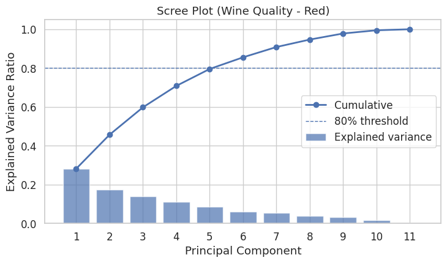

# 主成分分析

**主成分分析（Principal Component Analysis, PCA）** 是一种常用的数据降维方法，用来把高维数据（很多变量）转换成少数几个新的“综合指标”，同时尽可能保留原始信息。

与回归分析不同，PCA 不关心因果关系，它只看：

- 哪些变量变化最大；
- 哪些变量之间最相关；
- 怎样用更少的变量（主成分）来描述原始数据结构。


## 案例分析

以探究不同酒在化学成分上主要有哪些区别为例，做主成分分析。


### 数据集简介

| **属性**     | **内容**                                    |
| ------------ | ------------------------------------------- |
| **名称**     | Wine dataset（葡萄酒数据集）                |
| **来源**     | UCI Machine Learning Repository             |
| **样本数量** | 178 个葡萄酒样本                            |
| **特征数量** | 13 个化学指标（连续变量）                   |
| **类别数**   | 3 种葡萄酒产地（意大利同一地区的 3 个酒厂） |
| **任务类型** | 多分类 / 无监督降维演示 / 聚类可视化        |
| **适合展示** | PCA、LDA、聚类、特征可视化、特征相关性分析  |


### 数据特征说明

| **特征**                     | **含义**               |
| ---------------------------- | ---------------------- |
| Alcohol                      | 酒精含量               |
| Malic acid                   | 苹果酸                 |
| Ash                          | 灰分                   |
| Alcalinity of ash            | 灰分碱度               |
| Magnesium                    | 镁含量                 |
| Total phenols                | 总酚类                 |
| Flavanoids                   | 黄酮类化合物           |
| Nonflavanoid phenols         | 非黄酮类酚             |
| Proanthocyanins              | 原花青素               |
| Color intensity              | 色泽强度               |
| Hue                          | 色调                   |
| OD280/OD315 of diluted wines | 稀释葡萄酒的吸光度比值 |
| Proline                      | 脯氨酸含量（氨基酸）   |


### 分析顺序

| **步骤** | **操作**                                    | **目的**                                         |
| -------- | ------------------------------------------- | ------------------------------------------------ |
| ①        | **标准化数据（StandardScaler）**            | 确保不同量纲的变量可比较（酒精 vs 镁含量差异大） |
| ②        | **执行 PCA 降维**                           | 找到新的“主成分方向”——即最大化方差的线性组合     |
| ③        | **查看方差解释率（Scree Plot）**            | 决定保留多少主成分（如 PC1 + PC2 ≈ 56%）         |
| ④        | **绘制 PCA 散点图（2D 或 3D）**             | 观察样本在主成分空间中的分布或聚类               |
| ⑤        | **绘制载荷热图（Loadings Heatmap）**        | 解释每个主成分由哪些变量主导、这些方向意味着什么 |
| ⑥        | （可选）**解释主成分含义 + 与实际业务对应** | 例如：PC1 = 酒体浓度，PC2 = 颜色与酸度差异       |


## 代码

```python
# ===============================================
# PCA 示例：葡萄酒质量（winequality-red.csv）
# 文件可从 UCI 下载；该 CSV 使用分号分隔（sep=";"）
# ===============================================

import os
import numpy as np
import pandas as pd
import matplotlib.pyplot as plt
import seaborn as sns

from sklearn.preprocessing import StandardScaler
from sklearn.decomposition import PCA

# ---- 0) 全局绘图风格（避免中文乱码：此处仅用英文标签） ----
plt.rcParams['font.sans-serif'] = ['DejaVu Sans']
plt.rcParams['axes.unicode_minus'] = False
sns.set_theme(style="whitegrid", font="DejaVu Sans", font_scale=1.1)

# ---- 1) 读取数据 ----
CSV_PATH = "winequality-red.csv"  # 请把文件放在当前工作目录
if not os.path.exists(CSV_PATH):
    raise FileNotFoundError("请将 winequality-red.csv 放到当前工作目录下。")

df = pd.read_csv(CSV_PATH, sep=";")

# 目标变量（可选）
target_col = "quality" if "quality" in df.columns else None

# 仅选择数值特征做 PCA（排除目标质量列）
feature_cols = [c for c in df.columns if c != target_col]
X = df[feature_cols].astype(float)

# ---- 2) 标准化 ----
scaler = StandardScaler()
X_std = scaler.fit_transform(X)

# ---- 3) PCA 拟合（先保留全部分量，后面根据方差解释率决定保留几个）----
pca = PCA(n_components=len(feature_cols), random_state=42)
X_pca = pca.fit_transform(X_std)

explained_var = pca.explained_variance_ratio_
cum_explained = np.cumsum(explained_var)

# ---- 4) Scree Plot（含累计方差）----
plt.figure(figsize=(7.5, 4.5))
components = np.arange(1, len(explained_var) + 1)
plt.bar(components, explained_var, alpha=0.7, label="Explained variance")
plt.plot(components, cum_explained, marker="o", linewidth=2, label="Cumulative")
plt.axhline(0.8, linestyle="--", linewidth=1, label="80% threshold")
plt.xlabel("Principal Component")
plt.ylabel("Explained Variance Ratio")
plt.title("Scree Plot (Wine Quality - Red)")
plt.xticks(components)
plt.legend()
plt.tight_layout()
plt.show()

# ---- 5) 主成分载荷（Loadings）----
# pca.components_ 形状：(n_components, n_features)
# 每一行是一个主成分在原始特征上的权重（载荷），可理解为“方向向量”
loadings = pd.DataFrame(
    pca.components_,
    columns=feature_cols,
    index=[f"PC{i}" for i in range(1, len(feature_cols) + 1)]
)

# 查看前两主成分的绝对载荷 Top-k 特征（帮助命名）
def top_features_for_pc(pc_name, k=5):
    s = loadings.loc[pc_name].abs().sort_values(ascending=False)
    return s.head(k)

print("\nTop features contributing to PC1:")
print(top_features_for_pc("PC1", k=5))
print("\nTop features contributing to PC2:")
print(top_features_for_pc("PC2", k=5))

# ---- 6) 载荷热图（前若干主成分）----
k_pc = 5  # 可调整查看前 3~5 个主成分
plt.figure(figsize=(9, 5))
sns.heatmap(
    loadings.iloc[:k_pc],
    annot=True, fmt=".2f", cmap="vlag", center=0,
    cbar_kws={"label": "Loading"}
)
plt.title(f"Loadings Heatmap (Top {k_pc} PCs)")
plt.ylabel("Principal Components")
plt.xlabel("Original Features")
plt.tight_layout()
plt.show()

# ---- 7) 二维散点图（PC1 vs PC2），可按质量上色（若有 quality 列）----
pc_df = pd.DataFrame({
    "PC1": X_pca[:, 0],
    "PC2": X_pca[:, 1],
})
if target_col:
    pc_df[target_col] = df[target_col].values

plt.figure(figsize=(6.2, 5.2))
if target_col:
    sns.scatterplot(
        data=pc_df, x="PC1", y="PC2",
        hue=target_col, palette="viridis", edgecolor="white", s=50
    )
    plt.legend(title=target_col, bbox_to_anchor=(1.02, 1), loc="upper left")
else:
    sns.scatterplot(data=pc_df, x="PC1", y="PC2", edgecolor="white", s=50)

plt.title("PCA Scatter (PC1 vs PC2)")
plt.tight_layout()
plt.show()

# ---- 8) 可选：简单“biplot”箭头（展示少量特征方向，避免过密）----
# 只画载荷绝对值最大的前 m 个特征，便于阅读
m = 6
pc1_load = loadings.loc["PC1"]
pc2_load = loadings.loc["PC2"]
top_feats = (pc1_load.abs() + pc2_load.abs()).sort_values(ascending=False).head(m).index

plt.figure(figsize=(6.8, 5.4))
plt.scatter(pc_df["PC1"], pc_df["PC2"], alpha=0.5, s=18)
scale = 3.0  # 箭头缩放，按需要调整
for feat in top_feats:
    x, y = pc1_load[feat]*scale, pc2_load[feat]*scale
    plt.arrow(0, 0, x, y, head_width=0.08, head_length=0.1, length_includes_head=True)
    plt.text(x*1.07, y*1.07, feat, fontsize=10)

plt.axhline(0, color="gray", linewidth=1)
plt.axvline(0, color="gray", linewidth=1)
plt.xlabel("PC1")
plt.ylabel("PC2")
plt.title("PCA Biplot (Top Features Only)")
plt.tight_layout()
plt.show()

# ---- 9) 如需保留前 N 个主成分作为后续建模特征 ----
# 例如保留使累计方差>=80%的最小 N
N = int(np.argmax(cum_explained >= 0.80) + 1)
X_pca_N = X_pca[:, :N]
print(f"\nKeep first {N} PCs (cumulative explained variance = {cum_explained[N-1]:.3f})")
```


## 数据可视化

### 主成分碎石图



#### 图中各元素含义

- **蓝色柱形条（Explained variance）**

  每个柱代表一个主成分（PC1、PC2、PC3…）能解释的数据变异比例。

  例如，**PC1** 解释了约 **25%** 的方差，**PC2** 解释约 **20%**，之后依次递减。

- **蓝色折线（Cumulative）**

  表示前 N 个主成分累计解释的总方差比例。

  曲线越接近 1（即 100%），表示这些主成分越能完整代表原始数据。

- **虚线（80% threshold）**

  通常用作经验阈值：选取能解释总方差 80% 左右的前几个主成分。


#### 如何读懂这张图

1. **前两个主成分的重要性最高**

   从左到右看，PC1 与 PC2 的柱形明显较高，说明这两个主成分保留了最多的信息。

2. **累计方差到 80% 时拐点出现**

   折线在第 **5 个主成分** 附近跨过虚线（0.8），

   说明只需前 5 个主成分就能保留原始数据约 80% 的信息。

3. **后面主成分的贡献迅速减小**

   PC6 之后的柱几乎接近零，表示这些主成分主要是噪声或次要变化，可以忽略。


#### 结论与实际应用

- **保留主成分数量**：

  从这张图可见，保留 **前 5 个主成分** 即可，这样既减少维度，又保留大部分信息。

  （此时累计方差≈0.8）

- **分析意义**：

  在后续分析（如聚类、回归、可视化）中，你可以用前 2~5 个主成分代替原始 11 个理化指标。


> 这张碎石图告诉我们：红酒的 11 个理化指标可以通过 5 个主成分来概括，这 5 个主成分已经解释了约 80% 的数据变化，足以代表主要信息结构。


```
Top features contributing to PC1:
fixed acidity    0.489314
citric acid      0.463632
pH               0.438520
density          0.395353
sulphates        0.242921
Name: PC1, dtype: float64

Top features contributing to PC2:
total sulfur dioxide    0.569487
free sulfur dioxide     0.513567
alcohol                 0.386181
volatile acidity        0.274930
residual sugar          0.272080
Name: PC2, dtype: float64
```


