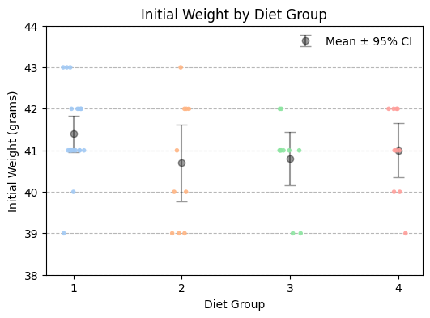
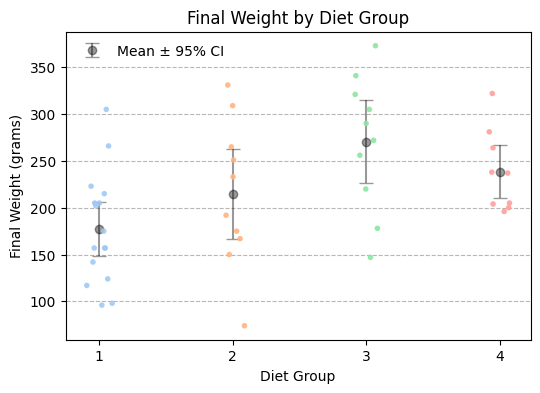
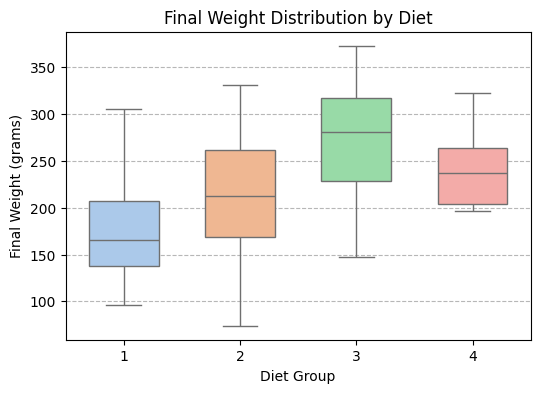
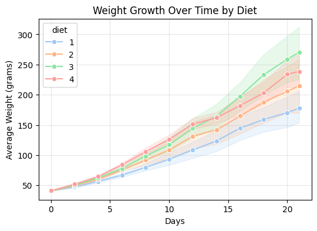
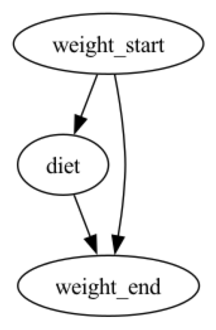
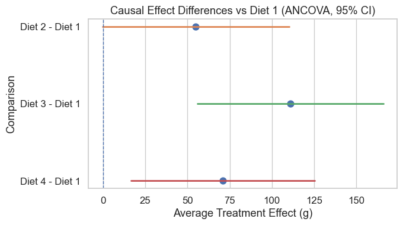
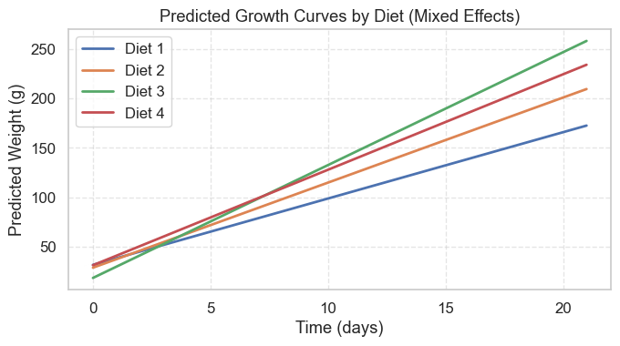

# 因果分析

------


日常生活中，我们想知道：运动能减肥吗？是不是运动一定能减肥，如果运动能减肥的话，哪种运动方式效果最好，是跑步、游泳还是瑜伽？


## 基本概念

在统计分析中，我们常常会问：

> “吃这种饲料的小鸡是不是长得更快？”

这类问题不是单纯的“相关性”问题，而是“因果性”问题。

**因果关系（Causality）指的是——当我们主动干预**一个变量（例如改变饲料类型），会不会引起另一个变量（如体重）的变化。


| 概念 | 定义 | 示例 |
|------|------|------|
| **相关性（Correlation）** | 两个变量一起变化，但不一定存在因果关系。 | 每天吃冰淇淋的人数与溺水人数高度相关，但这是因为夏天更热，而不是冰淇淋导致溺水。 |
| **因果性（Causation）** | 变量 A 的变化直接引起变量 B 的变化。 | 改变饲料类型，会引起小鸡体重的改变。 |

**核心思想**：

> 因果分析要回答“如果我们改变 X，会不会导致 Y 改变？”


### 因果推断三要素

| **概念**          | **在 ChickWeight 中的对应** | **作用**         |
| ----------------- | --------------------------- | ---------------- |
| Treatment（处理） | 饲料种类（Diet）            | 我们要干预的变量 |
| Outcome（结果）   | 最终体重（Weight）          | 饲料影响的结果   |
| Control（协变量） | 初始体重（weight_start）    | 控制潜在混杂     |


### 基本分析步骤

| **步骤**                    | **名称**                        | **主要任务**                                                 | **说明**                                                     |
| --------------------------- | ------------------------------- | ------------------------------------------------------------ | ------------------------------------------------------------ |
| **1. 提出研究问题**         | 明确因果假设                    | 明确要回答的“干预效应”问题，即如果改变某个因素 X，会不会导致结果 Y 的变化。 | 例如：改变饲料类型是否会导致小鸡体重增加？                   |
| **2. 构建因果模型**         | 绘制因果图（DAG）或建立理论框架 | 根据领域知识，明确潜在的因果路径与混杂变量。                 | 使用有向无环图（DAG）或结构方程表示因果结构。                |
| **3. 确定识别策略**         | 判断能否识别因果效应            | 检查是否满足“可识别性假设”，如：随机化、可忽略性（Ignorability）、稳定单元处理值假设（SUTVA）等。 | 若无法随机化，则需采用控制、匹配、加权等方法。               |
| **4. 选择估计方法**         | 选择合适的统计模型或算法        | 根据数据类型与研究目的，选择估计因果效应的技术方法。         | 例如：OLS、IPTW、Matching、AIPW、Regression Discontinuity、IV、Difference-in-Differences 等。 |
| **5. 执行估计与计算**       | 实际建模并计算 ATE 或 ATT       | 在控制混杂变量后，计算处理组与对照组的平均因果效应。         | 通过模型输出、置信区间与显著性水平判断结果可靠性。           |
| **6. 验证假设与稳健性分析** | 检查模型假设是否成立            | 检验共线性、平衡性（balance）、倾向得分分布、异方差等问题。  | 可使用敏感性分析（sensitivity analysis）或替代模型进行对比。 |
| **7. 解释与可视化结果**     | 解释因果效应并报告结论          | 将数值结果转化为因果意义的解释，展示图表（如效应图、DAG、权重分布）。 | 强调“因果解释”而非仅统计显著性。                             |


## 经典案例


### 实验设计

设计一个**随机对照实验（Randomized Controlled Trial）**。

- 将 50 只小鸡**随机分配**到 4 种不同饲料类型（Diet 1–4）。
- 所有小鸡都在相似的环境、温度、饲养条件下成长。
- 唯一的差异变量是 **饲料类型（Diet）**。
- 记录每只小鸡从出生到第 21 天的多次体重。


分组情况

| **饮食类型 (Diet)** | **小鸡数量 (Chick count)** |
| ------------------- | -------------------------- |
| 1                   | 18 只                      |
| 2                   | 10 只                      |
| 3                   | 10 只                      |
| 4                   | 12 只                      |
| **合计**            | **50 只**                  |


变量

| 变**量名** | **含义**         | **类型** |
| ---------- | ---------------- | -------- |
| weight     | 小鸡的体重（克） | 连续变量 |
| time       | 实验天数（0–21） | 数值型   |
| chick      | 小鸡编号（1–50） | 分组变量 |
| diet       | 饲料类型（1–4）  | 类别变量 |


饲料类型（Diet）是“因”（Treatment），体重（Weight）是“果”（Outcome），其他条件保持不变（Control），满足因果推断的“反事实框架”。


## 数据分析

### 小鸡的起始重量

了解一下小鸡的起始重量

```python
import pandas as pd
import matplotlib.pyplot as plt
import seaborn as sns
import numpy as np

# 读取数据
df = pd.read_csv("chickweight.csv")
df.columns = [c.strip().lower() for c in df.columns]
w0 = df[df["time"] == 0]

# 计算均值和95%置信区间
grouped = w0.groupby("diet")["weight"]
means = grouped.mean()
stds = grouped.std()
ns = grouped.count()
cis = 1.96 * stds / np.sqrt(ns)

# 绘图
plt.figure(figsize=(6,4))

# 先画条带图（每只小鸡的初始体重）
sns.stripplot(
    data=w0, 
    x="diet", y="weight", 
    palette="pastel", 
    hue="diet",
    alpha=0.9, 
    jitter=True, 
    size=4,
    legend=False
  
)

# 再叠加均值 ± 95% CI
plt.errorbar(
    means.index - 1,  # 因为 x 轴是分组编号 1~4，matplotlib 默认从 0 开始，需要减1
    means,
    yerr=cis,
    fmt='o',
    color='black',
    ecolor='black',
    elinewidth=1.5,
    capsize=5,
    markersize=6,
    label='Mean ± 95% CI',
    alpha=0.4,
)

# 图形样式
plt.title("Initial Weight by Diet Group")
plt.xlabel("Diet Group")
plt.ylabel("Initial Weight (grams)")
plt.ylim(38, 44)
plt.legend(frameon=False)
plt.grid(axis='y', linestyle='--', alpha=0.9)
plt.show()


# 输出为表格
summary = pd.DataFrame({
    "Mean": means.round(3),
    "Std": stds.round(3),
    "N": ns,
    "95% CI": cis.round(3)
})
print(summary)

# =============================
# 方差分析（ANOVA）
# =============================
groups = [w0.loc[w0["diet"] == i, "weight"] for i in sorted(w0["diet"].unique())]
f_stat, p_value = f_oneway(*groups)

print("=== 单因素方差分析（ANOVA） ===")
print(f"F 统计量: {f_stat:.3f}")
print(f"p 值: {p_value:.5f}")

if p_value < 0.05:
    print("→ 结论：不同饲料组的初始体重存在显著差异。")
else:
    print("→ 结论：不同饲料组的初始体重无显著差异（分组较平衡）。")
print()


```



数据的描述性分析

```
			Mean    Std   N  95% CI
diet                         
1     41.4  0.995  20   0.436
2     40.7  1.494  10   0.926
3     40.8  1.033  10   0.640
4     41.0  1.054  10   0.653
```

1. 四组的组间差异很小：四组平均体重都在 40.7–41.4 g 之间，说明实验开始时各组小鸡的初始体重非常接近。
2. 标准差反应组内一致性：饲料1组标准差最小（0.995），说明这组小鸡初始体重最均匀；饲料2组标准差最大（1.494），个体差异稍大。
3. 95%置信区间：饲料1组的平均体重 41.4 ± 0.436，意味着有95%的信心认为该组总体平均体重在[40.964, 41.836] 克之间，类似地，饲料2组为 [39.774, 41.626]。

```
=== 单因素方差分析（ANOVA） ===
F 统计量: 1.132
p 值: 0.34591
```

| **标**                    | **含义**                                                     | **解读**                                         |
| ------------------------- | ------------------------------------------------------------ | ------------------------------------------------ |
| **F统计量 (F-statistic)** | 衡量组间方差与组内方差的比值。值越大，组间差异越明显。       | 这里 F=1.132，说明组间差异与组内差异相比并不大。 |
| **p值 (p-value)**         | 代表「组间平均值差异是否显著」。当 p < 0.05 时，认为至少有一组与其他组显著不同。 | 这里 p=0.34591 > 0.05，说明统计上没有显著差异。  |


**结论**

四组小鸡在实验开始时体重差异不显著（均值几乎重叠，置信区间重叠明显），因此，可以认为 实验起点是平衡的，适合后续比较不同饲料对生长速度或最终体重的影响。实验起点公平，后续体重差异可归因于饲料效果，而非起始体重不同。


### 实验后的小鸡重量

#### 实验后的描述性分析

```python
import pandas as pd
import matplotlib.pyplot as plt
import seaborn as sns
import numpy as np
from scipy.stats import f_oneway
from statsmodels.stats.multicomp import pairwise_tukeyhsd

# 读取数据
df = pd.read_csv("chickweight.csv")
df.columns = [c.strip().lower() for c in df.columns]

# 选取实验结束时（最后一天）的小鸡体重
w_final = df[df["time"] == df["time"].max()]

# 计算均值和95%置信区间
grouped = w_final.groupby("diet")["weight"]
means = grouped.mean()
stds = grouped.std()
ns = grouped.count()
cis = 1.96 * stds / np.sqrt(ns)

# =============================
# 图1：条带图 + 平均值 ±95% CI
# =============================
plt.figure(figsize=(6,4))
sns.stripplot(
    data=w_final, 
    x="diet", y="weight", 
    palette="pastel", 
    hue="diet",
    alpha=0.9, 
    jitter=True, 
    size=4,
    legend=False
)

plt.errorbar(
    means.index - 1,
    means,
    yerr=cis,
    fmt='o',
    color='black',
    ecolor='black',
    elinewidth=1.5,
    capsize=5,
    markersize=6,
    label='Mean ± 95% CI',
    alpha=0.4,
)

plt.title("Final Weight by Diet Group")
plt.xlabel("Diet Group")
plt.ylabel("Final Weight (grams)")
plt.legend(frameon=False)
plt.grid(axis='y', linestyle='--', alpha=0.9)
plt.show()

# =============================
# 图2：箱线图 + 条带图叠加
# =============================
plt.figure(figsize=(6,4))
sns.boxplot(
    data=w_final, 
    x="diet", y="weight", 
    palette="pastel", 
    hue="diet",
    width=0.6,
    legend=False
)

plt.title("Final Weight Distribution by Diet (Boxplot)")
plt.xlabel("Diet Group")
plt.ylabel("Final Weight (grams)")
plt.grid(axis='y', linestyle='--', alpha=0.9)
plt.show()

# =============================
# 输出表格
# =============================
summary = pd.DataFrame({
    "Mean": means.round(3),
    "Std": stds.round(3),
    "N": ns,
    "95% CI": cis.round(3)
})
print("=== 描述性统计：实验结束时体重 ===")
print(summary)
print()

# =============================
# 方差分析（ANOVA）
# =============================
groups = [w_final.loc[w_final["diet"] == i, "weight"] for i in sorted(w_final["diet"].unique())]
f_stat, p_value = f_oneway(*groups)

print("=== 单因素方差分析（ANOVA） ===")
print(f"F 统计量: {f_stat:.3f}")
print(f"p 值: {p_value:.5f}")

if p_value < 0.05:
    print("→ 结论：不同饲料组的最终体重存在显著差异。")
else:
    print("→ 结论：不同饲料组的最终体重无显著差异。")
print()


```







=== 描述性统计：实验结束时体重 ===

```

         Mean     Std   N  95% CI
diet                             
1     177.750  58.702  16  28.764
2     214.700  78.138  10  48.431
3     270.300  71.623  10  44.392
4     238.556  43.348   9  28.321
```

结果解读

| **饲料组** | **平均体重 (g)** | **标准差** | **样本量** | **95% CI** | **说明**                                           |
| ---------- | ---------------- | ---------- | ---------- | ---------- | -------------------------------------------------- |
| **Diet 1** | 177.8            | 58.7       | 16         | ±28.8      | 体重最低，且个体差异较大，说明该饲料增重效果最弱。 |
| **Diet 2** | 214.7            | 78.1       | 10         | ±48.4      | 平均体重略高于 1 组，但波动很大，效果不稳定。      |
| **Diet 3** | 270.3            | 71.6       | 10         | ±44.4      | 平均体重最高，说明此饲料促进生长最显著。           |
| **Diet 4** | 238.6            | 43.3       | 9          | ±28.3      | 体重较高且标准差较小，说明该饲料效果较好且稳定。   |

意义

1. **饲料种类影响显著**

   平均体重从 ~178 g 到 ~270 g 变化，差距接近 100 g。说明不同饲料对生长的促进作用明显不同。

2. **Diet 3 最优**

   该组平均体重最高，说明其营养配比最有利于小鸡的体重增长。

3. **Diet 1 最弱**

   平均体重最低，且组内差异大，可能饲料营养不足或个体反应不一致。

4. **Diet 4 稳定性好**

   标准差最小，说明这组小鸡体重分布集中、生长一致。

5. **置信区间解读**

   例如 Diet 3 的 95% CI 为 ±44.4 ，意味着我们有 95% 的信心认为该组总体平均体重位于 270.3 ± 44.4 g 之间（约 226 – 315 g）。


### 过程增重的描述

```python
import pandas as pd
import matplotlib.pyplot as plt
import seaborn as sns
import numpy as np

# 读取数据
df = pd.read_csv("chickweight.csv")
df.columns = [c.strip().lower() for c in df.columns]

# =============================
# 可视化：各饲料组随时间体重变化
# =============================
plt.figure(figsize=(6,4))
sns.lineplot(
    data=df,
    x="time", y="weight",
    hue="diet",
    errorbar=('ci', 95),  # 显示均值 ±95% CI
    palette="pastel",
    marker="o"
)
plt.title("Weight Growth Over Time by Diet")
plt.xlabel("Days")
plt.ylabel("Average Weight (grams)")
plt.grid(alpha=0.3)
plt.show()

# =============================
# 计算每个时间点的描述性统计
# =============================
summary = (
    df.groupby(["time", "diet"])["weight"]
      .agg(Mean="mean", Std="std", N="count")
      .assign(CI=lambda s: 1.96 * s["Std"] / np.sqrt(s["N"]))
      .round(2)
)
print("=== 各时间点各饲料组体重描述统计 ===")
print(summary.reset_index().head(20))  # 仅显示前20行以便查看结构

# =============================
# 计算平均增重趋势（首尾差）
# =============================
first = df[df["time"] == df["time"].min()].groupby("diet")["weight"].mean()
last = df[df["time"] == df["time"].max()].groupby("diet")["weight"].mean()
gain = (last - first).round(2)

print("\n=== 实验期间平均增重（最终均值 - 初始均值） ===")
print(gain)

# =============================
# 简要解释
# =============================
print("\n=== 结果解读 ===")
for diet, g in gain.items():
    print(f"Diet {diet}: 平均增重 {g} 克。")
print("从结果可见，不同饲料组的体重增长速度不同，其中增重最多的组在曲线中上升最陡（通常为 Diet 3）。")
```



各时间点各饲料组体重描述统计

```
    time  diet    Mean    Std   N    CI
0      0     1   41.40   0.99  20  0.44
1      0     2   40.70   1.49  10  0.93
2      0     3   40.80   1.03  10  0.64
3      0     4   41.00   1.05  10  0.65
4      2     1   47.25   4.28  20  1.87
5      2     2   49.40   2.88  10  1.78
6      2     3   50.40   2.41  10  1.50
7      2     4   51.80   1.93  10  1.20
8      4     1   56.47   4.13  19  1.86
9      4     2   59.80   2.30  10  1.43
10     4     3   62.20   2.78  10  1.72
11     4     4   64.50   2.55  10  1.58
12     6     1   66.79   7.76  19  3.49
13     6     2   75.40   4.17  10  2.58
14     6     3   77.90   5.70  10  3.54
15     6     4   83.90   5.07  10  3.14
16     8     1   79.68  13.78  19  6.19
17     8     2   91.70  14.80  10  9.17
18     8     3   98.40  12.35  10  7.65
19     8     4  105.60   9.34  10  5.79
```

实验期间平均增重（最终均值 - 初始均值）

```
Diet 1: 平均增重 136.35 克。
Diet 2: 平均增重 174.0 克。
Diet 3: 平均增重 229.5 克。
Diet 4: 平均增重 197.56 克。
```

从结果可见，不同饲料组的体重增长速度不同，其中增重最多的组在曲线中上升最陡（通常为 Diet 3）。


## 相关与因果

我们已经通过描述性统计或 ANOVA 知道 **Diet 3 的小鸡体重最高**，但是我们仍然不能直接说：**Diet 3 导致了小鸡长得最快**。

最后的统计数据表明，Diet3 组的平均体重最高，这只是**观测到的相关现象**，但我们还不知道，这是由于饲料导致的，还是别的因素（如小鸡原来更健康，样本数量不同等等）。


因果分析要回答的是“如果我改变饲料，会不会导致体重变化？”，也就是所谓的 反事实问题（counterfactual）：

> 如果原来吃 Diet 1 的那只小鸡改吃 Diet 3，
> 它的体重是否真的会比现在更高？

这个问题不能靠平均数直接回答，因为它涉及**假设世界**（what-if world）。

| **类比**                           | **解释**                         |
| ---------------------------------- | -------------------------------- |
| 你发现“带伞的人更多的时候街上更湿” | 描述性统计：伞与湿度相关         |
| 但并不是“带伞导致下雨”             | 因果分析：要判断是“下雨导致带伞” |

同理，“Diet 3 小鸡更重” ≠ “Diet 3 导致更重”，还可能是 Diet 3 组原本的小鸡体质更好。


### 因果分析的目标

在控制其他因素后，判断“饲料种类”是否是**导致体重差异的真正原因**。


## 因果分析

```python
import pandas as pd
from dowhy import CausalModel

# 读取数据
df = pd.read_csv("chickweight.csv")
df.columns = [c.strip().lower() for c in df.columns]

# 提取实验开始（初始体重）与结束（最终体重）的数据
start = df[df["time"] == 0][["chick", "diet", "weight"]].rename(columns={"weight": "weight_start"})
end = df[df["time"] == df["time"].max()][["chick", "diet", "weight"]].rename(columns={"weight": "weight_end"})

# 合并前后体重
data = pd.merge(start, end, on=["chick", "diet"], how="inner")
data["gain"] = data["weight_end"] - data["weight_start"]

# ----------------------------
# 1. 定义因果模型
# ----------------------------
model = CausalModel(
    data=data,
    treatment="diet",       # 饲料类型
    outcome="weight_end",   # 最终体重
    common_causes=["weight_start"]  # 初始体重作为混杂变量
)

# 可视化因果图（可选）
model.view_model()

# ----------------------------
# 2. 识别因果效应
# ----------------------------
identified_estimand = model.identify_effect(proceed_when_unidentifiable=True)
print(identified_estimand)

# ----------------------------
# 3. 估计因果效应（使用线性回归）
# ----------------------------
estimate = model.estimate_effect(
    identified_estimand,
    method_name="backdoor.linear_regression"
)
print("因果效应估计值（平均效应 ATE）:")
print(estimate)

# ----------------------------
# 4. 随机化安慰检验（可选，检验稳健性）
# ----------------------------
refutation = model.refute_estimate(
    identified_estimand, estimate, method_name="placebo_treatment_refuter"
)
print(refutation)
```

运行后输出的图：



结果解读：

```
weight_start → diet → weight_end
      ↘──────────────↗
```

各节点含义：

| **节点**         | **含义**                       |
| ---------------- | ------------------------------ |
| **weight_start** | 小鸡的初始体重（实验前）       |
| **diet**         | 饲料类型（实验处理变量）       |
| **weight_end**   | 小鸡的最终体重（实验结果变量） |


各箭头含义：

| **箭头**                      | **含义**                                               |
| ----------------------------- | ------------------------------------------------------ |
| **weight_start → diet**       | 初始体重可能影响小鸡被分配到不同饲料组（潜在混杂关系） |
| **weight_start → weight_end** | 初始体重越大，小鸡可能最终体重也越大                   |
| **diet → weight_end**         | 饲料类型影响最终体重（我们要估计的因果效应）           |

DAG 的作用：告诉我们“需要控制谁”。
在 ChickWeight 中，weight_start 是混杂变量，必须在模型中控制，否则会高估 Diet 效果。

```markdown
Estimand type: EstimandType.NONPARAMETRIC_ATE

### Estimand : 1
Estimand name: backdoor
Estimand expression:
   d                               
───────(E[weight_end|weight_start])
d[diet]                            
Estimand assumption 1, Unconfoundedness: If U→{diet} and U→weight_end then P(weight_end|diet,weight_start,U) = P(weight_end|diet,weight_start)

### Estimand : 2
Estimand name: iv
No such variable(s) found!

### Estimand : 3
Estimand name: frontdoor
No such variable(s) found!

### Estimand : 4
Estimand name: general_adjustment
Estimand expression:
   d                               
───────(E[weight_end|weight_start])
d[diet]                            
Estimand assumption 1, Unconfoundedness: If U→{diet} and U→weight_end then P(weight_end|diet,weight_start,U) = P(weight_end|diet,weight_start)

因果效应估计值（平均效应 ATE）:
*** Causal Estimate ***

## Identified estimand
Estimand type: EstimandType.NONPARAMETRIC_ATE

### Estimand : 1
Estimand name: backdoor
Estimand expression:
   d                               
───────(E[weight_end|weight_start])
d[diet]                            
Estimand assumption 1, Unconfoundedness: If U→{diet} and U→weight_end then P(weight_end|diet,weight_start,U) = P(weight_end|diet,weight_start)

## Realized estimand
b: weight_end~diet+weight_start
Target units: ate

## Estimate
Mean value: 22.838360745962177
```


### 结论


当我们控制初始体重 (weight_start) 后，饲料 (diet) 对最终体重 (weight_end) 的平均因果效应（ATE）约为 22.84 克，也就是说——在平均意义上，**更换饲料会导致小鸡最终体重增加约 23 克**。

ATE 表示：

> “如果我们随机地把所有小鸡从原本的饲料换成某个目标饲料（这里是 Diet 3），
> 那么平均而言，小鸡的最终体重会增加（或减少）多少克。”

也就是说：

- “Treatment（处理）”是饲料类型 Diet。
- “Effect（效应）”是最终体重 weight_end 的变化。
- “Average” 表示对所有小鸡取平均效果。


> 为什么叫“平均”因果效应
> 	•	并不是每只小鸡都增加 22.8 g；
> 	•	有的小鸡可能增重 30 g，有的只 10 g；
> 	•	22.8 g 是总体平均效应。


能否“确定”Diet影响小鸡体重？


因果分析（DoWhy + 反事实）

- 你控制了初始体重 (weight_start)，排除了“原本体重大 → 吃特定饲料 → 更重”的混杂影响。
- 在控制后，模型估计的平均因果效应（ATE） ≈  +22 克。
  即在同等初始体重条件下，改变饲料类型平均能使小鸡体重增加约 22 克。
- 反事实模拟（如果全体都改喂 Diet 3）显示整体体重分布右移。
  这提供了“饲料 → 体重”因果影响的证据。

| **潜在问题**         | **说明**                                                     |
| -------------------- | ------------------------------------------------------------ |
| **分组是否真正随机** | 如果实验设计中饲料分配并非完全随机，仍可能有未控制混杂因素（如鸡的品种、性别、健康状况）。 |
| **样本量较小**       | 每组 9–16 只，估计的置信区间较宽，效应大小存在不确定性。     |
| **模型假设线性**     | 我们假设 weight_end 与 diet、weight_start 呈线性关系，但真实生长曲线可能非线性。 |


如何描述这个结论？

```
方差分析显示，不同饲料组的最终体重存在显著差异（p < 0.05）。
进一步的因果分析控制初始体重后，估计饲料对最终体重的平均因果效应为 22.8 克。
反事实模拟表明，若所有个体改喂 Diet 3，整体体重分布将明显右移。
因此，在本实验条件下，饲料类型可被视为影响小鸡体重的重要因素。
```


## 因果效应差异

当我们问：

> “跑步、游泳、瑜伽，哪种运动减肥效果最好？”

我们其实在问：**不同treatment之间的因果效应是否有差异？**

定义上：

- 因果效应（causal effect） = 处理组与对照组的结果之差；
- 因果效应差异（treatment effect heterogeneity）= 不同处理之间的效应差。


如果我们想回答哪种Diet的增重效果最好，可以计算因果效应差异。


### 代码

```python
# -*- coding: utf-8 -*-
# ChickWeight：多处理因果效应分析（ANCOVA）+ Seaborn 可视化（森林图）
# 说明：
# 1) 以“最终日体重”为结果（weight_final），以“基线体重”为协变量（weight0），Diet 为多处理
# 2) 用 ANCOVA 估计相对于 Diet 1 的平均因果效应（ATE）及 95% CI、p 值
# 3) 使用 Seaborn 绘制“因果效应差异森林图”（ATE ± 95% CI）
# 4) 可选：拟合混合效应模型（全时序），绘制各 Diet 的预测生长曲线（matplotlib）

import pandas as pd
import numpy as np
import matplotlib.pyplot as plt
import seaborn as sns
import statsmodels.api as sm
from statsmodels.formula.api import ols, mixedlm

# ---------------------------
# 0) 读取数据
# ---------------------------
# 若你的文件不在当前目录，请修改文件名为实际路径
df = pd.read_csv("chickweight.csv")

# ---------------------------
# 1) 构造面板：基线体重、最终体重与增量
# ---------------------------
baseline = df[df["time"] == 0][["chick", "weight"]].rename(columns={"weight": "weight0"})
final_idx = df.groupby("chick")["time"].idxmax()
final_df = df.loc[final_idx, ["chick", "diet", "weight", "time"]].rename(
    columns={"weight": "weight_final", "time": "time_final"}
)
panel = final_df.merge(baseline, on="chick", how="left")
panel["gain"] = panel["weight_final"] - panel["weight0"]
panel["diet"] = panel["diet"].astype(int)

# ---------------------------
# 2) 描述性统计（可选）
# ---------------------------
desc = panel.groupby("diet").agg(
    n=("chick", "count"),
    baseline_mean=("weight0", "mean"),
    final_mean=("weight_final", "mean"),
    gain_mean=("gain", "mean"),
    final_std=("weight_final", "std"),
    gain_std=("gain", "std"),
).round(2)
print("\n[Descriptives] ChickWeight by Diet")
print(desc)

# ---------------------------
# 3) 因果分析：ANCOVA（weight_final ~ C(diet) + weight0）
#    Diet 1 为基类，C(diet)[T.k] 系数 ≈ ATE(k,1)
# ---------------------------
ancova = ols("weight_final ~ C(diet) + weight0", data=panel).fit()
print("\n[ANCOVA Summary]\n")
print(ancova.summary())

# 3.1 在平均基线体重处，各 diet 的调整后均值与 95% CI
w0_bar = panel["weight0"].mean()
adj_means, adj_ci = {}, {}
for d in sorted(panel["diet"].unique()):
    X = {"Intercept": 1.0, "weight0": w0_bar}
    for k in sorted(panel["diet"].unique()):
        if k == 1:
            continue
        key = f"C(diet)[T.{k}]"
        X[key] = 1.0 if d == k else 0.0
    x_vec = pd.Series({k: X.get(k, 0.0) for k in ancova.params.index})
    mu = float(np.dot(x_vec.values, ancova.params.values))
    V = ancova.cov_params().values
    se = float(np.sqrt(np.dot(x_vec.values, np.dot(V, x_vec.values))))
    z = 1.96
    adj_means[d] = mu
    adj_ci[d] = (mu - z * se, mu + z * se)

adj_df = pd.DataFrame({
    "diet": sorted(adj_means.keys()),
    "adj_mean": [adj_means[d] for d in sorted(adj_means.keys())],
    "ci_low": [adj_ci[d][0] for d in sorted(adj_ci.keys())],
    "ci_high": [adj_ci[d][1] for d in sorted(adj_ci.keys())],
}).set_index("diet").round(2)
print("\n[Adjusted Means at mean(baseline)] Final Weight by Diet (95% CI)")
print(adj_df)

# 3.2 相对 Diet 1 的两两因果效应差异（ATE 与 95% CI、p 值）
pairwise = []
for d in sorted(panel["diet"].unique()):
    if d == 1:
        continue
    key = f"C(diet)[T.{d}]"
    est = ancova.params[key]
    ci_low, ci_high = ancova.conf_int().loc[key]
    p = ancova.pvalues[key]
    pairwise.append({
        "Comparison": f"Diet {d} - Diet 1",
        "ATE_est": est,
        "CI_low": ci_low,
        "CI_high": ci_high,
        "pvalue": p
    })
ate_df = pd.DataFrame(pairwise).round(3)
print("\n[Pairwise causal effect differences (ATE vs Diet 1)]")
print(ate_df)

# ---------------------------
# 4) Seaborn：因果效应差异“森林图”
# ---------------------------
# 误差条宽度（用于绘制 95% CI）
ate_df["err_low"]  = ate_df["ATE_est"] - ate_df["CI_low"]
ate_df["err_high"] = ate_df["CI_high"] - ate_df["ATE_est"]

sns.set(style="whitegrid", font_scale=1.1)
plt.figure(figsize=(7, 4))
# 点图（估计值）
ax = sns.pointplot(
    data=ate_df,
    x="ATE_est", y="Comparison",
    join=False
)
# 水平误差条（95% CI）
for i, row in ate_df.iterrows():
    plt.plot([row["CI_low"], row["CI_high"]], [i, i], linewidth=2)

# 参考线 x=0
plt.axvline(0, linestyle="--", linewidth=1)

plt.title("Causal Effect Differences vs Diet 1 (ANCOVA, 95% CI)")
plt.xlabel("Average Treatment Effect (g)")
plt.ylabel("Comparison")
plt.tight_layout()
plt.show()

# ---------------------------
# 5) （可选）混合效应模型：全时序生长曲线
#    weight ~ time * C(diet) + (1 | chick)
# ---------------------------
df_me = df.copy()
df_me["diet"] = df_me["diet"].astype("category")

mix = mixedlm("weight ~ time * C(diet)", data=df_me, groups=df_me["chick"]).fit(reml=True)
print("\n[Mixed Effects: fixed effects]\n")
print(mix.summary())

# 预测各 diet 的生长曲线（固定效应）
time_grid = np.linspace(df["time"].min(), df["time"].max(), 12)
pred_rows = []
for d in sorted(df_me["diet"].cat.categories.astype(int)):
    for t in time_grid:
        Xrow = pd.DataFrame({"time": [t], "diet": pd.Categorical([d], categories=df_me["diet"].cat.categories)})
        yhat = float(mix.predict(Xrow))
        pred_rows.append({"diet": int(d), "time": t, "pred_weight": yhat})
pred_df = pd.DataFrame(pred_rows)

plt.figure(figsize=(7, 4))
for d in sorted(pred_df["diet"].unique()):
    sub = pred_df[pred_df["diet"] == d]
    plt.plot(sub["time"], sub["pred_weight"], label=f"Diet {d}", linewidth=2)
plt.title("Predicted Growth Curves by Diet (Mixed Effects)")
plt.xlabel("Time (days)")
plt.ylabel("Predicted Weight (g)")
plt.legend()
plt.grid(True, linestyle="--", alpha=0.5)
plt.tight_layout()
plt.show()

# ---------------------------
# 6) 可选：保存模型摘要到当前目录
# ---------------------------
with open("ancova_summary.txt", "w", encoding="utf-8") as f:
    f.write(ancova.summary().as_text())
with open("mixedlm_summary.txt", "w", encoding="utf-8") as f:
    f.write(mix.summary().as_text())
print("\nSaved: ancova_summary.txt, mixedlm_summary.txt")
```


```
[Descriptives] ChickWeight by Diet
       n  baseline_mean  final_mean  gain_mean  final_std  gain_std
diet                                                               
1     20           41.4       156.3      114.9      69.96     69.78
2     10           40.7       214.7      174.0      78.14     78.99
3     10           40.8       270.3      229.5      71.62     71.11
4     10           41.0       229.3      188.3      50.27     50.91

[ANCOVA Summary]

                            OLS Regression Results                            
==============================================================================
Dep. Variable:           weight_final   R-squared:                       0.313
Model:                            OLS   Adj. R-squared:                  0.252
Method:                 Least Squares   F-statistic:                     5.135
Date:                Fri, 31 Oct 2025   Prob (F-statistic):            0.00171
Time:                        20:13:59   Log-Likelihood:                -280.16
No. Observations:                  50   AIC:                             570.3
Df Residuals:                      45   BIC:                             579.9
Df Model:                           4                                         
Covariance Type:            nonrobust                                         
================================================================================
                   coef    std err          t      P>|t|      [0.025      0.975]
--------------------------------------------------------------------------------
...
        Comparison  ATE_est  CI_low  CI_high  pvalue
0  Diet 2 - Diet 1   54.945  -0.515  110.406   0.052
1  Diet 3 - Diet 1  111.039  55.969  166.109   0.000
2  Diet 4 - Diet 1   71.026  16.562  125.490   0.012
```




森林图的结构

- **横轴（X 轴）**：Average Treatment Effect (g)，表示相对于 Diet 1 的平均体重差异。
  - 越往右 → 最终体重越高（比 Diet 1 更有效）。
  - 虚线 x = 0 → “无差异”基线。
  - 若置信区间（水平线）跨过 0 → 差异不显著。

- **纵轴（Y 轴）**：三种比较
  - Diet 2 – Diet 1
  - Diet 3 – Diet 1
  - Diet 4 – Diet 1

- **圆点**：估计的 ATE 值。
- **水平线段**：95 % 置信区间（CI）。
  表示在统计上我们有 95 % 的把握，真实效应位于这条线的范围内。


| **比较**            | **ATE (中点)** | **CI 范围**   | **结论**                                                     |
| ------------------- | -------------- | ------------- | ------------------------------------------------------------ |
| **Diet 2 – Diet 1** | 约 +55 g       | −0.5 ～ 110 g | 差异“边缘显著”；可能略优于 Diet 1，但也可能无差异（CI 几乎触 0） |
| **Diet 3 – Diet 1** | 约 +111 g      | 56 ～ 166 g   | 明显优于 Diet 1；置信区间完全在 0 右侧，且距离远，说明显著提升体重 |
| **Diet 4 – Diet 1** | 约 +71 g       | 17 ～ 125 g   | 也显著优于 Diet 1 （CI 不跨 0）                              |

结论：

1. **Diet 3 效果最强**：平均比 Diet 1 重 约 110 克，差异高度显著。
2. **Diet 4 次之**：平均 +70 克，也有显著提升。
3. **Diet 2 轻微优于 Diet 1**，但置信区间几乎包含 0，统计上只是接近显著。
4. 所有线段都在 0 右侧 → 饮食方案总体上都能增加体重，只是效果强弱不同。


```

[Mixed Effects: fixed effects]

            Mixed Linear Model Regression Results
==============================================================
Model:              MixedLM   Dependent Variable:   weight    
No. Observations:   578       Method:               REML      
No. Groups:         50        Scale:                643.3133  
Min. group size:    2         Log-Likelihood:       -2733.4523
Max. group size:    12        Converged:            Yes       
Mean group size:    11.6                                      
--------------------------------------------------------------
                   Coef.  Std.Err.   z    P>|z|  [0.025 0.975]
--------------------------------------------------------------
Intercept          31.514    6.116  5.153 0.000  19.527 43.502
C(diet)[T.2]       -2.881   10.547 -0.273 0.785 -23.553 17.792
C(diet)[T.3]      -13.264   10.547 -1.258 0.209 -33.937  7.409
C(diet)[T.4]       -0.402   10.556 -0.038 0.970 -21.091 20.288
time                6.711    0.258 25.972 0.000   6.205  7.218
time:C(diet)[T.2]   1.898    0.428  4.429 0.000   1.058  2.737
time:C(diet)[T.3]   4.711    0.428 10.997 0.000   3.872  5.551
time:C(diet)[T.4]   2.951    0.434  6.799 0.000   2.100  3.801
Group Var         545.659    5.149                            
==============================================================
```



| **图类型**             | **数据来源**                  | **含义**                                 |
| ---------------------- | ----------------------------- | ---------------------------------------- |
| **平均生长曲线图**     | 实际观测均值（平均线+置信带） | 原始实验数据的趋势，可见真实波动         |
| **混合效应模型预测图** | 模型拟合值（固定效应预测）    | 理论平均趋势，平滑、去噪后反映“真实效应” |
