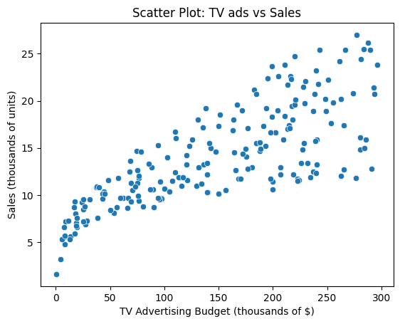
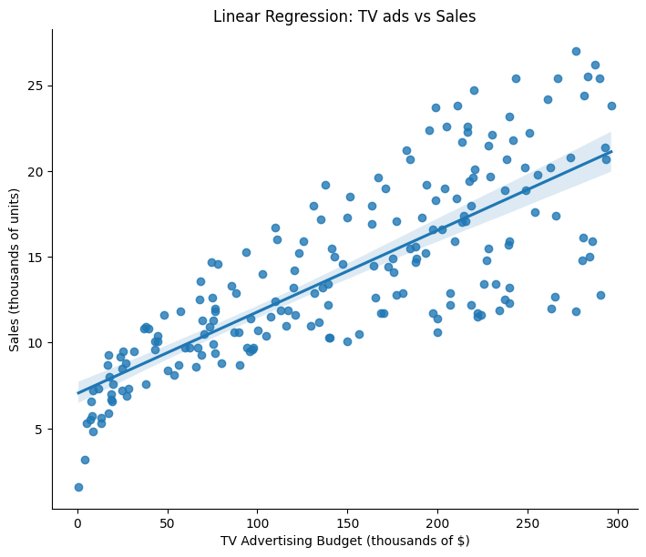
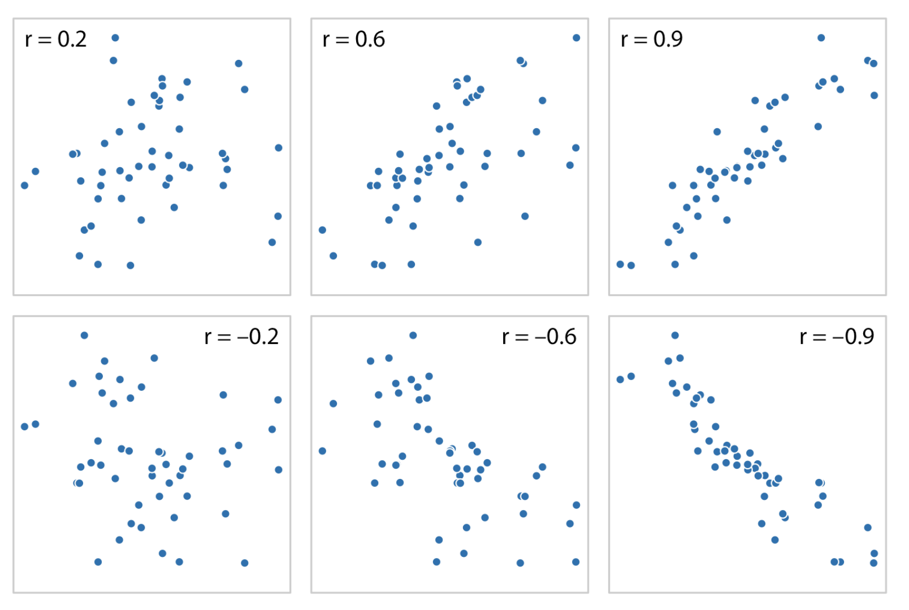
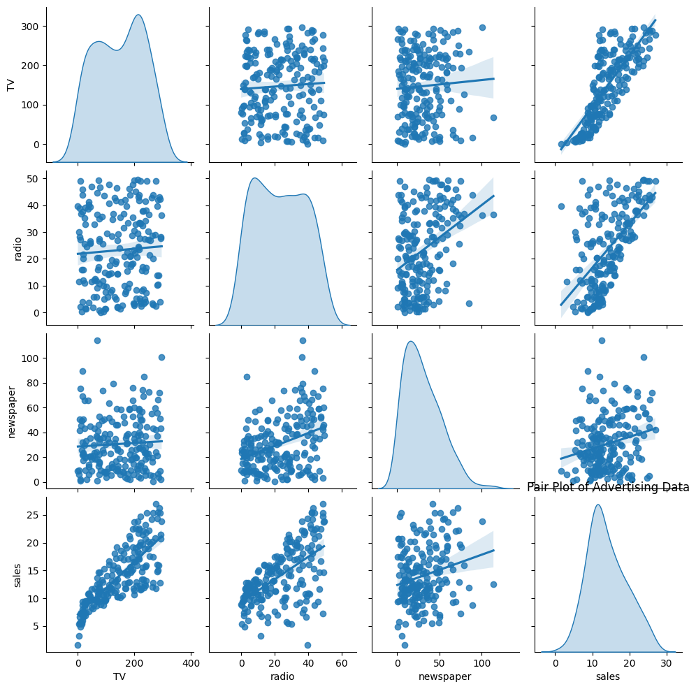
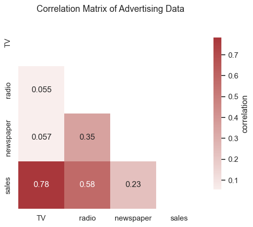

# 散点图

## 简介
散点图是一种二维图表，用点的形式表示两个变量之间的对应关系。

- 横坐标（x 轴）：一个变量（自变量）
- 纵坐标（y 轴）：另一个变量（因变量）

- 每个点代表一组观测值


### 功能

1. **展示变量之间的关系**
   - 判断变量之间是否存在线性关系、非线性关系或无关性。
2. **发现相关性**
   - 趋势向上 → 正相关
   - 趋势向下 → 负相关
   - 无明显趋势 → 无相关
3. **检测异常值 (outliers)**
   - 离群点会远离大部分数据，提示数据异常或特殊情况。
4. **分布与聚类分析**
   
   - 观察点的分布形态，判断是否存在某种分组或聚类现象。
5. **建模前的可视化检查**
   
   - 帮助决定是否适合用线性回归、多项式回归等模型。
   
   
## 优点

- **直观性强**：能快速判断变量之间的关系。
- **信息量大**：能同时展示所有观测点的分布情况。
- **易于发现规律**：趋势、相关性和聚类模式一目了然。
- **支持扩展**：可以通过颜色、大小等增加第三个变量的维度。


### 缺点

- **只能展示两个变量**（或加上颜色/大小后扩展到 3 个维度）。
- **数据量太大时会重叠**，难以看清规律（需用透明度或采样）。
- **关系复杂时不易解释**，尤其是非线性或多重交互效应。
- **不提供定量指标**，只能作为定性分析工具，需要配合统计方法（如相关系数、回归分析）。


## 绘制散点图

### 绘制电视广告投入与销量之间的散点图


```python
import seaborn as sns
import matplotlib.pyplot as plt
import pandas as pd

df=pd.read_csv("Advertising.csv")

sns.scatterplot(data=df, x="TV", y="sales")
plt.title("Scatter Plot: TV ads vs Sales")
plt.xlabel("TV Advertising Budget (thousands of $)")
plt.ylabel("Sales (thousands of units)")
```





### 添加回归函数


```python
sns.lmplot(data=df, x="TV", y="sales", height=6, aspect=1.2)
plt.title("Linear Regression: TV ads vs Sales")
plt.xlabel("TV Advertising Budget (thousands of $)")
plt.ylabel("Sales (thousands of units)")
plt.show()
```





### 计算相关性指数

```python
import pandas as pd

# 计算 TV 与 sales 的相关系数
r = df["TV"].corr(df["sales"])
print(r)
```


> 0.7822244248616066， r>0.6，证明两者有相关性


| r 值范围          | 相关性强度       |
| ----------------- | ---------------- |
| \|r\| > 0.7       | 强相关           |
| 0.3 ≤ \|r\| ≤ 0.7 | 中等相关         |
| \|r\| < 0.3       | 弱相关或几乎无关 |

不同r值的数据分布示例：



### 绘制残差图

```python
sns.residplot(x="TV", y="sales", data=df, lowess=True, color="red")
plt.title("Residual Plot: TV vs Sales")
plt.show()
```


观察残差分布的作用主要是用来 **验证模型是否合适**。残差就是「真实值 - 模型预测值」，如果模型合理，残差应该是“随机噪声”。如果点云在 0 上下随机分布 → 说明线性回归的假设成立。如果残差呈现出弯曲趋势 → 表明模型可能需要换成非线性回归。

### 绘制成对关系图

```python
sns.pairplot(df[["TV", "radio", "newspaper", "sales"]], kind="reg", diag_kind="kde")

plt.show()
```




####  自变量与销售额 (sales) 的关系
- **TV vs sales**：关系最明显，几乎呈线性正相关，说明电视广告投入越多，销量越高。  
- **radio vs sales**：也有正相关，但散点比 TV 分散，关系不如 TV 明显。  
- **newspaper vs sales**：相关性最弱，点云比较散，说明报纸广告对销量影响不大。  


#### 自变量之间的关系
- **TV 与 radio** 基本没有明显关系（点比较分散）。  
- **radio 与 newspaper** 有一定弱相关。  
- **TV 与 newspaper** 几乎无关。  


####  单变量分布
- 对角线上的 KDE 曲线展示了每个变量的分布：  
- **TV** 投入主要集中在 50~300 区间，有两个峰。  
- **radio** 投入相对均匀分布。  
- **newspaper** 投入偏小，大部分在 0~50 之间。  
- **sales**（销量）大部分集中在 10~20 之间。  


#### 总结
- **电视广告** 是影响销量的最主要因素；  
- **广播广告** 有一定作用，但不如电视显著；  
- **报纸广告** 几乎没有明显作用；  
- **各广告渠道之间** 基本独立。  


### 相关矩阵热图 （correlogram）

```python
import pandas as pd
import seaborn as sns
import matplotlib.pyplot as plt
import numpy as np

# 读取数据
df = pd.read_csv("Advertising.csv", index_col=0)

# 计算相关矩阵
corr = df.corr()

# 创建下三角掩码(
# 避免信息冗余
mask = np.triu(np.ones_like(corr, dtype=bool))

# 绘制热图
sns.set_theme(style="white")
plt.figure(figsize=(6, 5))
ax = sns.heatmap(
    corr, mask=mask, cmap="vlag", center=0, annot=True,
    cbar_kws={"shrink": 0.8, "label": "correlation"}
)

# 设置标题
plt.title("Correlation Matrix of Advertising Data", fontsize=13, pad=10)
plt.show()
```




## 拟合函数

### 使用sklearn

```python
from sklearn.linear_model import LinearRegression

X = df[["TV", "radio", "newspaper"]]  # 多元自变量
y = df["sales"]

model = LinearRegression()
model.fit(X, y)

print("截距:", model.intercept_)
print("回归系数:", model.coef_)
```

```python
截距: 2.9388893694594085
回归系数: [ 0.04576465  0.18853002 -0.00103749]
```


### Python定义函数

```python
def predict_sales(TV, radio, newspaper):
    intercept = 2.9388893694594085
    coef_TV = 0.04576465
    coef_radio = 0.18853002
    coef_newspaper = -0.00103749
    
    sales = intercept + coef_TV * TV + coef_radio * radio + coef_newspaper * newspaper
    return sales
```


### 预测销量

```python
# 输入 TV=100, radio=20, newspaper=30
print(predict_sales(100, 20, 30))  

```


> 11.254830069459409
