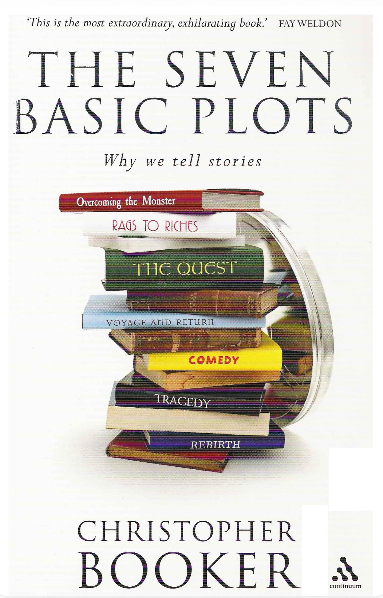

# 故事类型
人类的故事，无论是神话、小说、戏剧还是电影，都可以归结为七种基本的叙事模式。这七种模式是：

1. **Overcoming the Monster（战胜怪物）** 
   主人公面对强大的邪恶力量或怪物，最终将其击败，恢复秩序。 
   例子：《贝奥武夫》、*Jaws*、《星球大战》。

2. **Rags to Riches（白手起家）** 
   主人公从卑微或贫困的境地出发，经历挫折，最终获得财富、地位或幸福。 
   例子：《灰姑娘》、*Aladdin*、《简·爱》。

3. **The Quest（探险/寻求）**  
   主人公与同伴们踏上一段旅程，经历困难与考验，目标是找到某个宝物或完成任务。 
   例子：《魔戒》、*Indiana Jones*、《西游记》。

4. **Voyage and Return（历险归来）**  
   主人公进入一个陌生世界，经历奇异冒险或危险，最终带着成长和智慧回到原来的地方。 
   例子：《爱丽丝梦游仙境》、*The Odyssey*、《纳尼亚传奇》。

5. **Comedy（喜剧）**  
   通常是误会、阻碍和混乱带来冲突，最终真相揭开，误会化解，大家获得圆满结局。 
   例子：莎士比亚《仲夏夜之梦》、浪漫喜剧电影。

6. **Tragedy（悲剧）**  
   主人公的缺陷或错误导致堕落和毁灭，带来观众的怜悯和恐惧。 
   例子：《麦克白》、*Hamlet*、《安娜·卡列尼娜》。

7. **Rebirth（重生）**  
   主人公陷入困境或黑暗中，但通过某种启示、牺牲或转变获得新生。 
   例子：《美女与野兽》、*A Christmas Carol*、《睡美人》。

