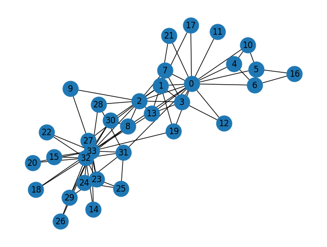
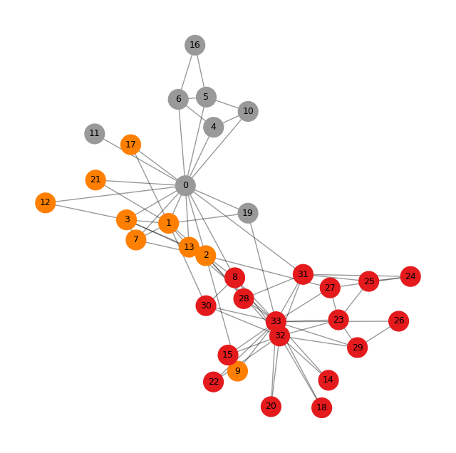
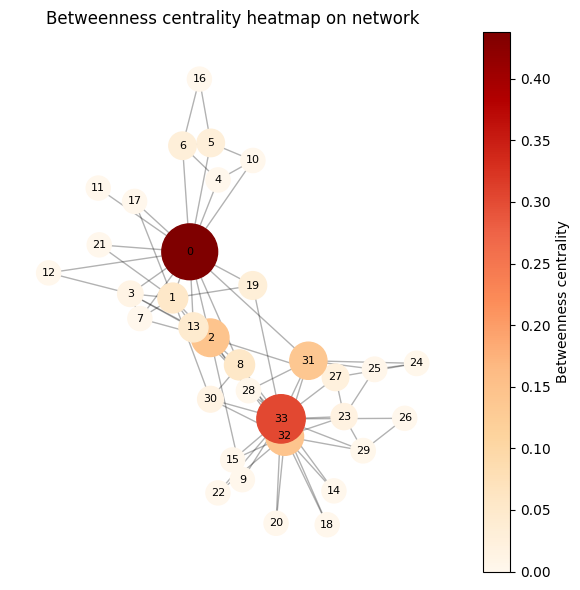
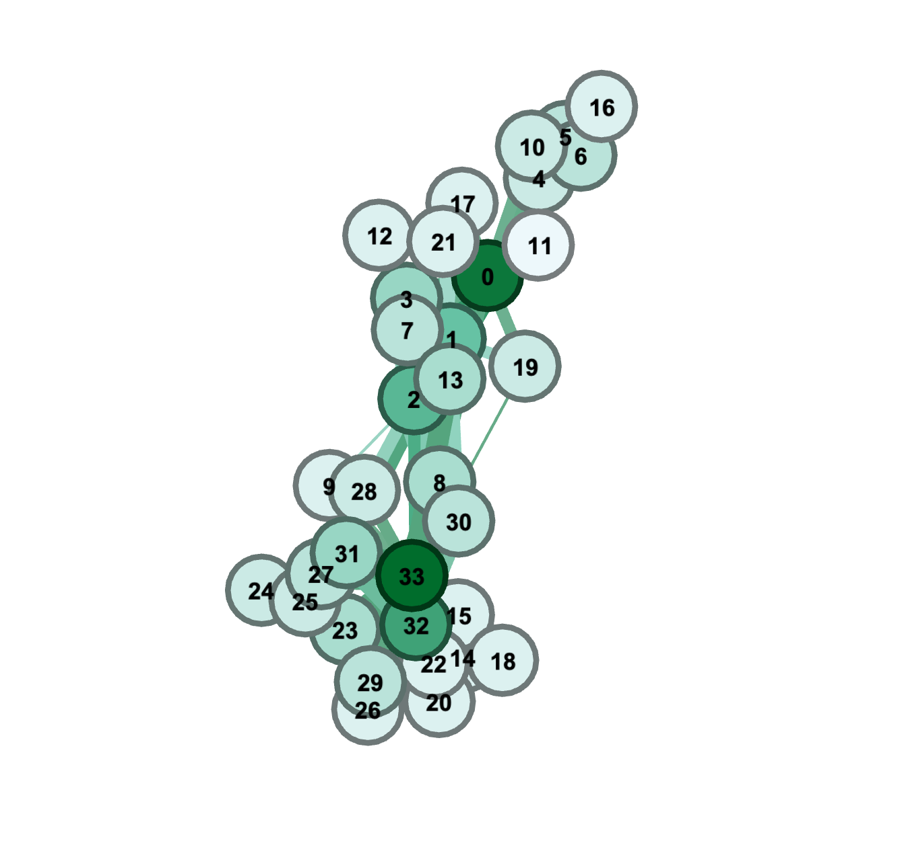

# 社会网络分析及其可视化


## 社会网络分析

社会网络分析（Social Network Analysis, SNA）是一套用来研究“人与人、组织与组织之间关系结构”的方法。它重点不在个人本身，而在于**关系**：谁和谁联系、联系强弱如何、信息在关系网络中如何流动、哪些节点在网络中最重要等。


### 研究关系结构，而不是孤立的个体
社会网络分析把个体（人、组织、国家等）视为“节点”，把关系（合作、交流、交易、关注、信任等）视为“边”。

它主要回答的问题包括：

- 谁与谁联系得最紧密？
- 网络中有没有“核心人物”“关键组织”？
- 信息是怎样在网络中传播的？
- 哪些节点连接了原本不相连的群体？

###  衡量节点的重要性

SNA会计算一些指标来判断谁在网络中更关键，比如：

- 度中心性（Degree centrality）：一个节点连接了多少人。
- 中介中心性（Betweenness）：谁在网络中起“桥梁”作用。
- 接近中心性（Closeness）：谁更容易接触到网络所有其他人。
- 特征向量中心性（Eigenvector）：节点不仅自己重要，还连接重要的人。

这些指标可以用来识别“影响力者”“传播关键节点”等。


### 分析网络中的群体结构

SNA可以发现：

- 社会群体（比如朋友圈、合作圈）
- 组织内部的小群体或者部门壁垒
- 社群之间的联系强度
- 隐性关系或潜在合作路径

技术上通常用到**聚类、社区发现**等方法。


### 典型应用领域

社会网络分析非常广泛，常见于：

- **社交媒体分析**（微博、推特上的关系、传播、意见领袖）
- **组织行为学**（公司内部沟通分析、找出合作瓶颈）
- **公共卫生**（疫情传播路径分析）
- **犯罪网络分析**（揭示犯罪团伙的核心成员）
- **学术分析**（合作网络、引用网络）
- **用户体验与语言服务领域**（分析用户群体、知识传播结构）


## 案例背景

故事发生在 20 世纪 70 年代早期，地点是美国一所大学的校园空手道俱乐部。俱乐部成员之间除了训练，还经常一起参加聚会、外出和社交活动，因此形成了密集的社交网络。

研究者 Wayne W. Zachary 在 1970–1972 年间系统观察并记录了俱乐部内部：

- 谁与谁一起活动
- 成员之间的亲密程度
- 社交互动次数

他最终构建了一个 34 人的社交网络，每条边代表成员间的互动或友谊。


### 冲突的出现：俱乐部领导人与管理员意见不合

俱乐部有两个核心人物：
1.	Instructor（教练）——网络数据中对应节点 0（不同论文编号略有差异）
2.	Administrator（管理员）——对应 节点 33


他们在俱乐部的运营方式、课程费用和管理理念上产生了尖锐分歧。

随着时间推移，俱乐部成员开始在社交上“站队”：

- 喜欢教练的成员逐渐围绕教练形成一个社群
- 认同管理员的人围绕管理员形成另一群


这些倾向在网络结构中体现得非常明显，**两个社区在网络中自然形成，没有任何算法都能肉眼看出。**这就是它为什么成为 SNA 经久不衰的示范案例的原因。


### 最终结果：俱乐部分裂成两个组织

冲突升级后，俱乐部最终 正式分裂成两个独立的俱乐部。

成员分布如下：
- 一些成员选择跟随原教练，加入他新的俱乐部
-  另外一些成员留在原来的俱乐部，由管理员负责

真实世界的结果与 Zachary 收集的社交网络结构 高度吻合：
- 	在网络里属于教练社区的人，大多数最终也选择了教练阵营
-	社区划分算法（例如 Girvan–Newman 或 Louvain）几乎可以 100% 准确预测成员最终选择

这使得该数据成为：
-	社会网络分析中“社区检测”的标杆教材
-	“社交结构如何预测行为”的最佳案例之一


## 网络分析过程


### 明确分析对象

Zachary 的研究对象：
- 节点：空手道俱乐部 34 名成员
- 边：成员之间在课外有交往（互动次数反映权重）
- 网络类型：无向、加权图
	
### 数据收集

Zachary 在 1970–1972 对俱乐部成员进行了 参与式观察：
- 记录成员之间的互动
- 记录共同出席活动
- 打分形成频率矩阵（interaction matrix）

最终得到 34×34 的邻接矩阵（或边列表）


### 指标分析

#### 度中心性（Degree Centrality）

用于找“最受欢迎”或“最活跃”的成员。

在空手道俱乐部中：度中心性最高的人是 0 号（Mr. Hi）和 33 号（Club President John A）

这对应了：一个是教练，一个是管理员，两派领袖。


> **他们很重要，连边很多，是自然的中心人物。**


#### 介数中心性（Betweenness Centrality）

用于识别“桥梁人物”“分裂风险点”。

使用 Brandes 算法计算最短路径上的关键节点。

在空手道俱乐部中：
- 节点 2、1、3 等有高介数中心性
- 这些人并不是“最受欢迎”，但他们位于两派之间
- 他们的立场左右着俱乐部分裂的方向
	

### 社区检测（Community Detection）

算法：Girvan–Newman

步骤：
1. 找介数最高的边
2. 删除
3. 再计算
4. 不断迭代直到网络分裂成两块

在空手道数据上：
- GN 算法自动把 34 个节点分成两群
- 结果与俱乐部实际后来的现实分裂高度吻合


### 可视化

用力导向算法（Fruchterman-Reingold 或 ForceAtlas2）绘图：

特点：

- 边多的节点会更靠近
- 关系密切的成员自然聚成团
- 两派显著分离


## 工具介绍

### NetworkX (Python)

- **特点**：最经典、最易用的社会网络分析库。
- **能做什么**：中心性、路径、社区发现、图可视化等。
- **适合**：教学、科研、小中规模网络（几十万节点以内）。
- **优势**：简单易用，生态丰富，与 pandas/scikit-learn 深度融合。


### 功能

**1. 创建并操作图结构**
支持：

- 有向图
- 无向图
- 多重图（多条边）
- 自定义节点属性、边属性

```python
import networkx as nx

G = nx.Graph()
G.add_node("A")
G.add_edge("A", "B")
```
**2. 计算中心性指标（核心功能）**

社会网络分析常用的所有指标都能算：

- Degree centrality（度中心性）
- Betweenness centrality（中介中心性）
- Closeness centrality（接近中心性）
- Eigenvector centrality（特征向量中心性）
- PageRank（网页排名指标）


```python
nx.betweenness_centrality(G)
```


**3. 分析网络结构**

- 最短路径
- 连通分量
- 聚类系数
- 图直径、平均距离
- 社区发现（基于 Girvan–Newman、Louvain 等）


**4. 可视化**

NetworkX 有基本可视化功能（但不如 Gephi 好看）：

```python
import matplotlib.pyplot as plt
nx.draw(G)
plt.show()
```


**5. 与 Pandas、Numpy、Scikit-Learn 配合**

可以从 CSV / DataFrame 直接构建图：

```python
import pandas as pd

df = pd.read_csv("edges.csv")
G = nx.from_pandas_edgelist(df, source="source", target="target")
```

NLP / 文本处理背景的人，可以轻松用它分析：

- 词语共现网络
- 引文网络
- 学术合作网络
- 用户行为网络
- 技术写作系统中的术语传播网络


### 优缺点

优点：

- 入门简单，适合学习 SNA
- Python 生态完善
- 小中规模图性能稳定（几十万节点以内）
- 文档齐全，科研论文中非常常见

缺点：

- 不适合处理特别大的图（上千万节点）
- 可视化能力不如 Gephi、Cytoscape
- 高性能需求时可换 igraph 或 Graph-tool


与Gephi的关系

| **工具**     | **类型**       | **用途**                   |
| ------------ | -------------- | -------------------------- |
| **NetworkX** | Python 库      | 计算、建模、算法、数据处理 |
| **Gephi**    | 桌面可视化软件 | 绘图、美化、探索式分析     |

实际研究中常常这样组合使用：


1. 用 NetworkX 读取与处理数据、计算指标
2. 输出 GEXF 文件
3. 用 Gephi 打开 GEXF 进行布局与可视化


```python
nx.write_gexf(G, "network.gexf")
```


## 代码实现

### 0. 安装networkx

```bash
!pip install networkx
```


### **1. 加载空手道数据**

```python
import networkx as nx

G = nx.karate_club_graph()
print(G.number_of_nodes(), G.number_of_edges())
```


```
34 78

```

表示这个图中有 34 个节点（共 34 名成员参与了 Zachary 的研究），有 78 条边（总共有 78 对成员在研究期间被观察到有社交联系）

### 2. 可视化一个网络 

```python
import matplotlib.pyplot as plt

nx.draw(G, with_labels=True, node_size=500) #每个节点的面积大小为 500（像素的平方）左右
plt.show()
```




### 3. 计算度中心性（合作/连接最多的）

```python
deg = nx.degree_centrality(G)
sorted(deg.items(), key=lambda x: -x[1])[:5]
```


nx.degree_centrality(G) 的输出是每个节点的 **度中心性**，公式为：

degree_centrality(node) = 该节点的度数 / (N - 1)

其中 N 是整个图的节点数量。

对于 Zachary 空手道俱乐部网络，N = 34，因此：

分母 (N−1) = 33。

```python
[(33, 0.5151515151515151),
 (0, 0.48484848484848486),
 (32, 0.36363636363636365),
 (2, 0.30303030303030304),
 (1, 0.2727272727272727)]
```


| **节点** | **度中心性** | **解释**                                                     |
| -------- | ------------ | ------------------------------------------------------------ |
| 33       | 0.515        | 节点 33 与 17 个节点相连（17/33 ≈ 0.515）。它是全图最关键的“交往中心”，高度活跃，很可能是网络中的领导者或关键人物。 |
| 0        | 0.485        | 节点 0 与 16 个节点相连（16/33）。它也是非常核心的成员，是另一个主要中心节点。 |
| 32       | 0.364        | 与约 12 个节点相连（12/33）。属于比较重要但没有 33、0 那么关键的次级中心。 |
| 2        | 0.303        | 与约 10 个节点相连（10/33）。处于网络较显眼位置，但不是最中心的人。 |
| 1        | 0.273        | 与约 9 个节点相连（9/33）。属于较活跃的成员，但中心性进一步降低。 |


这和经典研究的结论一致：

- 节点 33 通常对应“Mr. Hi”阵营的核心
- 节点 0 对应“John A”阵营的核心


### 4. 介数中心性（“桥梁”角色）

```python
bet = nx.betweenness_centrality(G)
sorted(bet.items(), key=lambda x: -x[1])[:5]
```

**中介中心性（betweenness centrality）** 衡量一个节点在网络中充当“桥梁”或“中间人”的程度。

公式的核心思想：

一个节点越多地位于其它节点之间的最短路径上，中介中心性越高。

因此：

- 高值 = 该节点对网络的连通、信息流动非常关键
- 移除高值节点通常会破坏网络结构、导致群体分裂

```
[(0, 0.43763528138528146),
 (33, 0.30407497594997596),
 (32, 0.145247113997114),
 (2, 0.14365680615680618),
 (31, 0.13827561327561325)]
```

| **节点** | **中介中心性** | **意义**                                                     |
| -------- | -------------- | ------------------------------------------------------------ |
| **0**    | 0.438          | 处于最多最短路径上，是全图最关键的“桥梁节点”，在不同子群体之间起核心通道作用。 |
| **33**   | 0.304          | 也是一个重要桥梁，但略弱于 0。仍是网络中核心领导者之一。     |
| **32**   | 0.145          | 中等桥梁节点，连接了不同社区的重要路径。                     |
| **2**    | 0.144          | 和 32 类似，也是跨社区的次级桥梁。                           |
| **31**   | 0.138          | 在特定社群之间的最短路径上出现频繁，是隐含的中介角色。       |


### 5. PageRank（最被依赖/最“权威”的）

```python
pr = nx.pagerank(G)
sorted(pr.items(), key=lambda x: -x[1])[:5]
```

PageRank 衡量的是：

一个节点的重要性取决于：

1. 有多少节点指向它（连接数量）
2. 指向它的节点本身是否重要（连接质量）

用一句话概括：

**不仅要“朋友多”，还要“朋友的重要”。**

因此，PageRank 代表的是一种“声望”或“影响力”指标。

```
[(33, 0.09698041880501741),
 (0, 0.08850807396280014),
 (32, 0.07592643687005646),
 (2, 0.06276686454603017),
 (1, 0.05741484049711006)]
```


| **节点** | **PageRank 值** | **含义**                                                     |
| -------- | --------------- | ------------------------------------------------------------ |
| **33**   | 0.097           | 网络中声望最高的节点，具有最强的“影响力”。其他重要节点也倾向于连接它。 |
| **0**    | 0.089           | 第二高影响力节点，位置重要性仅次于节点 33。                  |
| **32**   | 0.076           | 影响力稳固的中层核心节点。                                   |
| **2**    | 0.063           | 连接数量与连接质量都不错，属于次中心。                       |
| **1**    | 0.057           | 虽然不如前几名核心，但仍属于重要成员。                       |

度中心性前五是：

33, 0, 32, 2, 1

PageRank 前五也是：

33, 0, 32, 2, 1

这说明：

- Karate Club 图的结构使得连接数量本身就能很好代表“重要性”
- 核心节点之间彼此互相连接，使 PageRank 权重也集中在它们身上

> **PageRank 是一种“加权的度中心性”，但这里网络本身具有明显核心结构，使得两者非常一致。**

### 6.做简单社区划分 

```python
from networkx.algorithms.community import girvan_newman

communities = next(girvan_newman(G))
print([list(c) for c in communities])


```

这个算法通过 不断删除介数中心性最高的边，使网络自动分裂成多个社区。

高介数的边通常是“跨社区的桥梁边”。
当这些边被删掉后，网络会分成内部紧密、外部松散的两大块。


```
[[0, 1, 3, 4, 5, 6, 7, 10, 11, 12, 13, 16, 17, 19, 21], [2, 8, 9, 14, 15, 18, 20, 22, 23, 24, 25, 26, 27, 28, 29, 30, 31, 32, 33]]
```

社区 A（15 个节点）

```
[0, 1, 3, 4, 5, 6, 7, 10, 11, 12, 13, 16, 17, 19, 21]
```

- 中介中心性最高的是 node **0**
- 他是俱乐部管理员，对多个子群体有连接
- 这个社区节点内部连接较密集，与社区 B 较少连接


社区 B（19 个节点）

```
[2, 8, 9, 14, 15, 18, 20, 22, 23, 24, 25, 26, 27, 28, 29, 30, 31, 32, 33]
```

- 节点 **33** 与大量节点直接相连，是训练师阵营的核心
- 他社区内部结构紧密，连接强度高
- 多个重要节点（32、31、2）支持这一社区


这正对应了 **Zachary 空手道俱乐部分裂后的两个派别**：

- **社区 A** 通常被认为属于 **“John A”（俱乐部管理员）派别**
- **社区 B** 属于 **“Mr. Hi”（空手道教练）派别**

研究者 Zachary 在 1970s 的观察中指出，这两个领导者的冲突最终导致俱乐部分裂，成员分别跟随两位领导者。


## 可视化

### 社区上色

```python
import networkx as nx
import matplotlib.pyplot as plt
from networkx.algorithms.community import greedy_modularity_communities

# 1. 读入图（空手道俱乐部示例）
G = nx.karate_club_graph()

# 2. 社区检测（这里用 greedy_modularity_communities，适合演示）
communities = list(greedy_modularity_communities(G))

# 3. 给每个节点一个社区编号
node2comm = {}
for i, com in enumerate(communities):
    for node in com:
        node2comm[node] = i   # i 就是社区编号：0,1,2,...

# 4. 准备颜色列表（每个节点对应一个社区编号）
colors = [node2comm[n] for n in G.nodes()]

# 5. 画图：颜色 = 社区编号
plt.figure(figsize=(8, 8))
pos = nx.spring_layout(G, seed=42)  # 固定布局，方便反复对比

nx.draw_networkx_nodes(G, pos,
                       node_color=colors,
                       cmap=plt.cm.Set1,   # 使用一个离散色图
                       node_size=400)
nx.draw_networkx_edges(G, pos, alpha=0.4)
nx.draw_networkx_labels(G, pos, font_size=9)

plt.axis("off")
plt.show()
```




### 热力图

```python
import networkx as nx
import matplotlib.pyplot as plt

# 如果你已经有 G 和 bet，可以从这里往下写
# 这里用空手道俱乐部作为示例
G = nx.karate_club_graph()
bet = nx.betweenness_centrality(G)

# 1. 计算布局
pos = nx.spring_layout(G, seed=42)  # seed 只是为了每次布局一致

# 2. 把 betweenness 数值取出来
values = list(bet.values())

# 3. 画图
plt.figure(figsize=(6, 6))

# 节点：颜色 = betweenness，大小也随 betweenness 变化
nodes = nx.draw_networkx_nodes(
    G,
    pos,
    node_color=values,                # 用 betweenness 当颜色
    cmap=plt.cm.OrRd,                 # 热力图风格颜色（可以改成 viridis, plasma 等）
    node_size=[300 + 3000*v for v in values],  # 中介中心性越大，节点越大
)

# 边
nx.draw_networkx_edges(G, pos, alpha=0.3)

# 节点标签（显示节点编号）
nx.draw_networkx_labels(G, pos, font_size=8)

# 4. 加一个 colorbar，显示数值含义
cbar = plt.colorbar(nodes)
cbar.set_label("Betweenness centrality")

plt.title("Betweenness centrality heatmap on network")
plt.axis("off")
plt.tight_layout()
plt.show()
```





### Gephi 美化

导出数据

```python
nx.write_gexf(G, "karate_club.gexf")
```

然后在 Gephi 里进行以下操作：


**(1) 打开文件 → Statistics → 运行 “Modularity（模块度）”**
Gephi 会给节点自动上色，形成两个清晰的社区。


**(2) 运行布局算法 → ForceAtlas2**
图像会自然展开，呈现两派分离结构。

**(3) 设置节点大小 = 度中心性（Degree）**
你会看到俱乐部领导者节点会被放大（比如“Mr. Hi”和“Officer”）。


