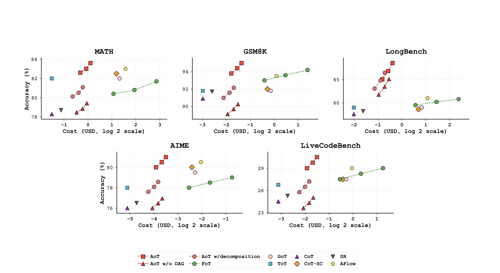
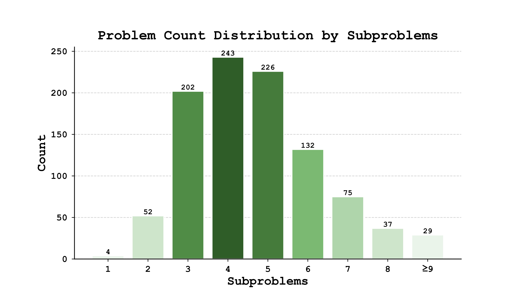

# 请评价下方科学图标的使用

## 使用形状

请评价下方图标是否使用恰当。

请评价色彩是否使用恰当

出处：

Teng, F., Shi, Q., Yu, Z., Zhang, J., Wu, C., Luo, Y., & Guo, Z. (2025). Atom of Thoughts for Markov LLM Test-Time Scaling. arXiv preprint arXiv:2502.12018. DOI: https://doi.org/10.48550/arXiv.2502.12018

